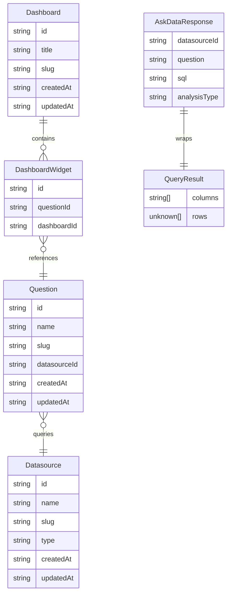

# Project Context: ask-data

ask-data is a client-side natural-language-to-SQL analytics tool. Users connect datasources (CSV, JSON, DuckDB), ask questions in plain English or Portuguese, and receive charts and tables powered by DuckDB WASM running in the browser.

The codebase is being refactored toward hexagonal architecture so the UI, storage, query engine, and deployment mode are independently replaceable.



## Domain Vocabulary

**Datasource** — A named data source (CSV, JSON, Parquet, DuckDB) that the user connects to. Stored as `Datasource` in `src/core/entities/datasource.ts`. Previously named `DataSourceConfig` in `src/shared/types/`.

**Question** — A saved natural-language query paired with a datasource. Stores the NL question text, the resolved SQL, and visualization preferences. Stored as `Question` in `src/core/entities/question.ts`. Previously named `QuestionConfig`.

**Dashboard** — A named collection of `DashboardWidget`s. Stored as `Dashboard` in `src/core/entities/dashboard.ts`.

**DashboardWidget** — A positioned widget on a dashboard that references one `Question`. Stored as `DashboardWidget` in `src/core/entities/dashboard.ts`.

**QueryResult** — The raw result of a SQL query: `{ columns: string[]; rows: unknown[] }`. Lives in `src/core/entities/query-result.ts`.

**AskDataRequest** — Input to the `AskData` use case: `{ question: string; datasourceId: string }` plus optional clarification context.

**AskDataResponse** — Output of the `AskData` use case: the resolved `AskIntent`, generated SQL, `QueryResult`, chart decision, and narrative. Lives in `src/core/entities/ask.ts`.

**AskIntent** — The parsed representation of a natural-language question: analysis type, metrics, dimensions, filters, date range. Internal to the ask model layer.

**Port** — A TypeScript interface in `src/core/application/ports/` that defines what the application needs (e.g., `DatasourceRepository`, `QueryEngine`) without specifying how it is implemented.

**Adapter** — A concrete implementation of a port. Lives in `src/adapters/`. Never imported by `core` or `features`.

**Use Case** — A class in `src/core/application/use-cases/` that orchestrates business actions using only ports and entity types. Example: `CreateDatasource`, `AskData`.

**Composition Container** — A factory function in `src/composition/` that wires concrete adapters into use cases. The app startup picks one container based on `VITE_RUNTIME_MODE`.

**QueryEngine** — The port interface that abstracts SQL query execution: `execute({ datasourceId, sql }) → Promise<QueryResult>`. Implemented by `DuckDbWasmQueryEngine` in the browser and `MemoryQueryEngine` in tests.

**Registry** — The current (pre-refactor) term for feature-local data files that call `localStorage` directly (e.g., `datasource-registry.ts`). Being replaced by `LocalStorage*Repository` adapters.

**YAML Seed** — Static YAML configuration files under `src/features/*/data/` that provide pre-seeded demo datasources, questions, and dashboards. Will be wrapped behind a `YamlSeed*Repository` adapter.

**Catalog** — The in-memory semantic description of a datasource: field names, roles (measure/dimension/time/key), sample values, cardinalities, and detected relationships. Built by `CatalogBuilder` in the ask model layer.

**AskDataEngine** — The central class in `src/features/ask/model/ask-data.ts` that coordinates catalog building, question parsing, SQL planning, query execution, result analysis, and narrative generation. Being refactored into the `AskData` use case.

## Layer Rules (post-refactor)

```
src/features/*/ui     →  src/core/application/use-cases
src/core/use-cases    →  src/core/application/ports + src/core/entities
src/adapters          →  src/core/application/ports + src/core/entities
src/composition       →  everything (wiring only)
src/infra             →  framework bootstrap only
```

`core` must not import from `features`, `adapters`, `infra`, or `shared/ui`.
`features` must not import from `adapters`, `infra`, or peer feature folders.
