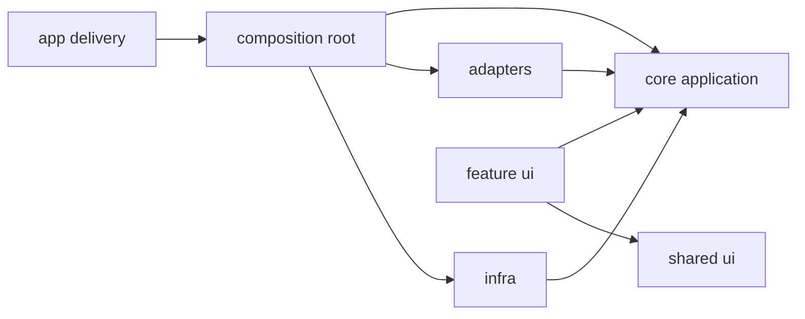

# Task: Map architecture boundaries and fitness rules

## Priority

P0 — Required before refactoring so later tasks can target explicit boundaries instead of subjective layering preferences.

## Dependencies

- Depends on ADR `docs/adrs/001-define-clean-architecture-boundaries.md`.
- No task dependency; this is the first implementation task.

## Assignability

**HITL** — requires human approval of ADR 001 boundary choices before lint rules are tightened.

## Context

The repository already has `core`, `features`, `adapters`, `infra`, `composition`, `app`, and `shared`, but the boundaries are not consistently enforced. This task documents the target module map, introduces executable architecture fitness tests, and tightens only the rules that can pass after this task's own scoped moves.

## Use Cases

- **Feature**: Architecture navigation
- **Scenario**: Developer locates the business core
- **Given** a developer opens the repository
- **When** they inspect the top-level `src` structure and architecture docs
- **Then** they can identify BI use cases, ports, adapters, delivery code, and UI code without reading framework details first

## Definition of Ready

- ADR `docs/adrs/001-define-clean-architecture-boundaries.md` exists.
- Current imports that violate desired boundaries are listed before rule changes are made.
- The task scope excludes moving business behavior; it only documents and guards boundaries that can be safely enforced now.

## Functional Requirements

- `FR-001`: Add an architecture map document that defines allowed responsibilities for `core`, `features`, `adapters`, `infra`, `composition`, `app`, and `shared`.
- `FR-002`: Add or update automated import-boundary checks so new code cannot worsen dependency direction.
- `FR-003`: Identify existing boundary violations as explicit migration debt instead of silently allowing them.
- `FR-004`: Keep the application behavior unchanged after the boundary map and fitness rules are added.

## Non-Functional Requirements

- `NFR-001`: Boundary checks must run through the existing `npm run lint` flow.
- `NFR-002`: Rules must avoid blocking all future work because of known legacy violations; use scoped exceptions with comments where needed.
- `NFR-003`: The architecture map must use BI domain language: Datasource, Question, Dashboard, Ask Data, Semantic Model, Extension Point, Capability, and Deployment Mode.

## Observability Requirements

- `OBS-001`: Not applicable — this task adds architecture rules and documentation, not runtime behavior.

## Acceptance Criteria

- `AC-001`: **Given** a new import from `core` to `features`, **When** lint runs, **Then** the import is rejected.
- `AC-002`: **Given** an allowed adapter import from `adapters` to `core`, **When** lint runs, **Then** the import is accepted.
- `AC-003`: **Given** a developer reads the architecture map, **When** they look for deployment mode ownership, **Then** they find it assigned to composition/adapters rather than core.
- `AC-004`: **Given** the current application tests, **When** this task is complete, **Then** no runtime behavior changes are required for tests to pass.

## Required Tests

### Unit Tests

- `UT-001`: Validate any boundary-classification helper or fixture used by architecture fitness tests. Covers `FR-002`.

### Integration Tests

- `IT-001`: **Scenario**: Lint rejects a forbidden import fixture  
  **Given** an architecture fixture with a `core` import from `features`  
  **When** the boundary test or lint rule executes  
  **Then** the violation is reported  
  Covers `FR-002`, `AC-001`.

### Smoke Tests

- `SMK-001`: Run `npm run lint` and verify the new architecture checks execute. Covers `NFR-001`.

### End-to-End Tests

- `E2E-001`: Not applicable — no user journey changes.

### Regression Tests

- `REG-001`: Not applicable — no known previous defect is targeted.

### Performance Tests

- `PT-001`: Not applicable — runtime performance is unchanged.

### Security Tests

- `ST-001`: Not applicable — no trust boundary or input handling behavior changes.

### Usability Tests

- `UX-001`: Not applicable — user-facing UI is unchanged.

### Observability Tests

- `OT-001`: Not applicable — runtime telemetry is unchanged.

## Definition of Done

- Code is implemented behind the correct domain, service, component, or adapter boundary.
- Required tests for this task pass.
- Loading, empty, validation, server error, and permission-denied states are handled where applicable.
- Required telemetry is implemented and verified.
- Required ADRs are updated from `Proposed` to `Accepted` or left with explicit open questions.
- API contracts, user-facing behavior, ADRs, or operational runbooks are documented when changed.
