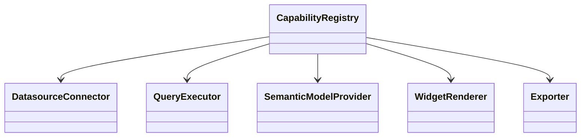

# Task: Define BI platform contracts and capabilities

## Priority

P0 — Required before extension, feature flag, deployment, and UI refactors can depend on stable contracts.

## Dependencies

- Depends on Task 001: Map architecture boundaries and fitness rules.
- Depends on ADR `docs/adrs/001-define-clean-architecture-boundaries.md`.
- Depends on ADR `docs/adrs/002-establish-bi-extension-platform.md`.

## Assignability

**HITL** — requires human approval of the initial public extension points in ADR 002.

## Context

Portable BI needs user-extensible capabilities like datasource connectors, query engines, semantic matching, visualization widgets, exporters, and storage providers. This task defines the stable platform contracts and capability metadata without implementing external plugin loading.

## Use Cases

- **Feature**: BI extension contract
- **Scenario**: Extension author discovers supported contribution points
- **Given** a developer wants to add a custom datasource connector
- **When** they inspect the platform contracts
- **Then** they find a stable datasource connector interface and capability metadata without importing feature UI internals

## Definition of Ready

- Task 001 has established the boundary map.
- ADR 002 identifies which extension points are in the first platform contract.
- The initial scope explicitly excludes remote plugin loading, sandboxing, marketplace packaging, and permission prompts.

## Functional Requirements

- `FR-001`: Define platform contracts for datasource connectors, query executors, semantic model providers, widget renderers, exporters, and storage providers.
- `FR-002`: Define `Capability` metadata with stable IDs, display names, contribution type, enabled state, and optional feature flag key.
- `FR-003`: Define registration APIs that allow built-in and future external contributions to register without importing internal feature modules.
- `FR-004`: Keep existing UI and runtime behavior unchanged by adapting current built-ins behind the new contracts only where needed for compilation and tests.

## Non-Functional Requirements

- `NFR-001`: Contracts must live in an inner application/platform area that does not import Lit, Chart.js, DuckDB-WASM, Fuse, MiniSearch, Transformers.js, browser storage, or HTTP.
- `NFR-002`: Interfaces must be narrow and role-specific; avoid a single generic plugin interface that exposes all internals.
- `NFR-003`: Contract names must use BI domain vocabulary from `CONTEXT.md`.

## Observability Requirements

- `OBS-001`: Define observability event names for capability registration success and failure, but do not require runtime event emission until the observability boundary task.
- `OBS-002`: Capability metadata must not include secrets, datasource credentials, or full SQL bodies.

## Acceptance Criteria

- `AC-001`: **Given** platform contracts are imported in a core test, **When** the test runs in Node, **Then** no browser, UI, or database runtime is required.
- `AC-002`: **Given** two contributions implement the same extension point, **When** they are registered, **Then** they are addressable polymorphically through shared contracts.
- `AC-003`: **Given** a disabled capability, **When** the registry returns available capabilities, **Then** the disabled contribution is excluded or marked unavailable according to the contract.
- `AC-004`: **Given** current app behavior, **When** the contracts are added, **Then** existing user journeys still work.

## Required Tests

### Unit Tests

- `UT-001`: Register multiple capabilities and verify lookup by ID and contribution type. Covers `FR-002`, `FR-003`.
- `UT-002`: Verify duplicate capability IDs produce a deterministic error. Covers `FR-003`.
- `UT-003`: Verify contracts compile without imports from UI, adapter, infra, or external library modules. Covers `NFR-001`.

### Integration Tests

- `IT-001`: **Scenario**: Built-in contribution registers through the platform registry  
  **Given** a built-in datasource connector contribution  
  **When** composition registers it  
  **Then** the capability registry exposes it through the platform contract  
  Covers `FR-003`, `AC-002`.

### Smoke Tests

- `SMK-001`: Run `npm run typecheck` to verify contract consumers compile. Covers `AC-001`.

### End-to-End Tests

- `E2E-001`: Not applicable — this task introduces contracts but does not change a complete user journey.

### Regression Tests

- `REG-001`: Not applicable — no known previous defect is targeted.

### Performance Tests

- `PT-001`: Not applicable — registry operations are in-memory and not performance-sensitive at current scale.

### Security Tests

- `ST-001`: Verify capability metadata cannot include configured secret fields when serialized for UI. Covers `OBS-002`.

### Usability Tests

- `UX-001`: Not applicable — no user-facing UI changes.

### Observability Tests

- `OT-001`: Not applicable — this task defines event names only; emission is handled later.

## Definition of Done

- Code is implemented behind the correct domain, service, component, or adapter boundary.
- Required tests for this task pass.
- Loading, empty, validation, server error, and permission-denied states are handled where applicable.
- Required telemetry is implemented and verified.
- Required ADRs are updated from `Proposed` to `Accepted` or left with explicit open questions.
- API contracts, user-facing behavior, ADRs, or operational runbooks are documented when changed.
