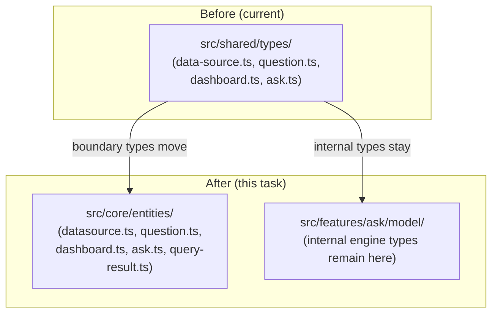

# Task: Define Core Entities

## Priority

P0 — All subsequent tasks depend on the canonical entity types being in `src/core/entities/`. No behavior changes in this task.

## Dependencies

- Depends on ADR `docs/adrs/004-hexagonal-architecture-boundaries.md` (zones determine what belongs in core).
- No task dependency; this is the first task in the sequence.

## Assignability

**AFK** — Move and rename only. No logic changes. All acceptance criteria are mechanically verifiable.

## Context

The project currently keeps entity types in `src/shared/types/` (`data-source.ts`, `question.ts`, `dashboard.ts`, `ask.ts`). The `ask.ts` file alone is 416 lines and mixes boundary types (request/response shapes) with internal engine implementation types (field roles, catalog fields, fuse indexes).

This task creates `src/core/entities/` and moves the seven boundary-level domain types there. Internal engine types that are used only inside `src/features/ask/model/` are **not** moved — they remain co-located with the ask feature model files.

Type renames required:

| Old name           | New name          | Old location                  |
| ------------------ | ----------------- | ----------------------------- |
| `DataSourceConfig` | `Datasource`      | `shared/types/data-source.ts` |
| `QuestionConfig`   | `Question`        | `shared/types/question.ts`    |
| `Dashboard`        | `Dashboard`       | `shared/types/dashboard.ts`   |
| `Widget`           | `DashboardWidget` | `shared/types/dashboard.ts`   |
| `AskDataConfig`    | `AskDataConfig`   | `shared/types/ask.ts`         |
| `AskResult`        | `AskDataResponse` | `shared/types/ask.ts`         |
| _(new)_            | `QueryResult`     | _(new in core/entities)_      |

## Use Cases

- **Feature**: Core entity stability
- **Scenario**: Developer imports Datasource type from core
- **Given** the refactoring is complete
- **When** a developer imports `Datasource` from `@/core/entities`
- **Then** they get the canonical type with no transitive infrastructure imports

---

- **Feature**: Core entity isolation
- **Scenario**: Core entity file has no forbidden imports
- **Given** `src/core/entities/datasource.ts` is linted
- **When** ESLint runs on the file
- **Then** no import from `features`, `adapters`, `infra`, `shared/ui`, or browser APIs is reported

## Definition of Ready

- ADR `docs/adrs/004-hexagonal-architecture-boundaries.md` exists as a stub confirming the layer model.
- The seven entity names and their source locations are documented above.
- `QueryResult` shape is defined: `{ columns: string[]; rows: unknown[] }`.

## Functional Requirements

- `FR-001`: All seven entity types listed above exist in `src/core/entities/` with stable exported names.
- `FR-002`: `src/core/entities/index.ts` re-exports all entities.
- `FR-003`: Every import of the old types in `src/` is updated to import from `@/core/entities`.
- `FR-004`: The old type files in `src/shared/types/` that only contained moved types are removed or reduced to re-exports pointing to `@/core/entities` (to avoid breaking external references during migration).
- `FR-005`: Internal ask engine types (`FieldConfig`, `CatalogField`, `AskIntent`, `Relationship`, etc.) remain in `src/features/ask/model/` or `src/shared/types/ask.ts` — they are not moved in this task.

## Non-Functional Requirements

- `NFR-001`: The TypeScript compiler reports zero new errors after this task.
- `NFR-002`: No runtime behavior changes — this task moves types only, not logic.
- `NFR-003`: Entity files in `src/core/entities/` must not import from `localStorage`, `fetch`, `LitElement`, DuckDB, YAML loaders, or DOM APIs.

## Observability Requirements

- `OBS-001`: Not applicable — type definitions have no runtime telemetry surface.

## Acceptance Criteria

- `AC-001`: **Given** `src/core/entities/datasource.ts`, **When** it is inspected, **Then** it contains the `Datasource` type and no forbidden imports.
- `AC-002`: **Given** `src/core/entities/index.ts`, **When** it is imported, **Then** all seven entity types are available as named exports.
- `AC-003`: **Given** the full codebase, **When** TypeScript compiles, **Then** zero errors are reported.
- `AC-004`: **Given** `src/core/entities/` files, **When** linted, **Then** no imports from `features`, `adapters`, `infra`, or `shared/ui` appear.

## Required Tests

### Unit Tests

- `UT-001`: Validate that `QueryResult` type accepts `{ columns: string[], rows: unknown[] }` and rejects missing fields. Covers `FR-001`.
- `UT-002`: Validate that `Datasource` factory (if any) produces a valid entity with all required fields. Covers `FR-001`.

### Integration Tests

Not applicable — this task moves types; no runtime boundaries are crossed.

### Smoke Tests

- `SMK-001`: **Scenario**: App still loads after type migration  
  **Given** all entity imports are updated  
  **When** `vite build` completes  
  **Then** it exits with code 0 and the bundle includes the app shell  
  Covers release confidence for `FR-003`.

### End-to-End Tests

Not applicable — no user-visible behavior changes.

### Regression Tests

Not applicable — no known previous defect in this area.

### Performance Tests

Not applicable — type moves have no runtime performance impact.

### Security Tests

Not applicable — no trust boundary or input handling changes.

### Usability Tests

Not applicable — no user-facing changes.

### Observability Tests

Not applicable — no telemetry changes.

## Definition of Done

- Code is implemented in `src/core/entities/` with no forbidden imports.
- `SMK-001` and `UT-001`, `UT-002` pass.
- `tsc --noEmit` reports zero errors.
- `vite build` exits with code 0.
- ADR `docs/adrs/004-hexagonal-architecture-boundaries.md` remains linked.
