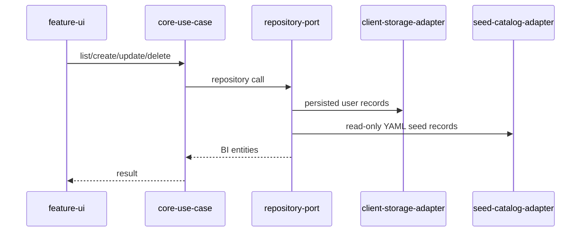

# Task: Unify Datasource, Question, and Dashboard persistence behind use cases

## Priority

P0 — Current feature registries and clean repositories are parallel persistence paths; this blocks reliable client-only and future server deployments.

## Dependencies

- Depends on Task 001: Map architecture boundaries and fitness rules.
- Depends on Task 002: Define BI platform contracts and capabilities.
- Depends on ADR `docs/adrs/001-define-clean-architecture-boundaries.md`.

## Assignability

**AFK** — the migration can be implemented behind existing behavior with explicit compatibility tests and no unresolved architecture decision beyond ADR 001.

## Context

`features/*/data/*-registry.ts` currently mixes YAML seed loading, browser `localStorage`, slug generation, timestamps, and mutations. `adapters/client/local-storage/*-repository.ts` already implements repository ports for the clean use cases. This task makes list/create/update/delete flows consistently go through application use cases while preserving seed data and client-only persistence.

## Use Cases

- **Feature**: BI catalog persistence
- **Scenario**: User creates and edits BI assets in client-only mode
- **Given** the app is running without a server
- **When** the user creates a datasource, question, or dashboard
- **Then** the asset is persisted through the same application use case contracts used by other deployment modes

## Definition of Ready

- Task 002 contracts exist for datasource/storage capabilities where relevant.
- Existing seed YAML behavior for datasources, questions, and dashboards is documented by tests.
- Existing localStorage keys and legacy dashboard format risks are identified before changing persistence paths.

## Functional Requirements

- `FR-001`: Route datasource list, create, update, and delete behavior through datasource use cases and repository ports.
- `FR-002`: Route question list, create, update, and delete behavior through question use cases and repository ports.
- `FR-003`: Route dashboard list, create, update, and delete behavior through dashboard use cases and repository ports while preserving legacy dashboard config compatibility.
- `FR-004`: Convert YAML seed registries into read-only seed adapters or repository decorators instead of direct UI dependencies.
- `FR-005`: Preserve client-only localStorage behavior for user-created BI assets.

## Non-Functional Requirements

- `NFR-001`: UI components must not import `features/*/data/*-registry.ts` after migration.
- `NFR-002`: The migration must be vertical and incremental; each asset type must remain usable after its slice is migrated.
- `NFR-003`: Repository ports must remain stable for HTTP, memory, and localStorage adapters.

## Observability Requirements

- `OBS-001`: Log repository adapter failures with asset type, operation, and result, without logging datasource URLs, SQL, or full dashboard JSON.
- `OBS-002`: Record a lightweight event or metric for catalog mutation success/failure where the existing observability abstraction supports it.

## Acceptance Criteria

- `AC-001`: **Given** seed datasources exist, **When** the datasource list renders, **Then** seed and user datasources appear through use-case-backed data.
- `AC-002`: **Given** a user-created question, **When** the app reloads in client-only mode, **Then** the question is loaded through the question repository path.
- `AC-003`: **Given** a dashboard stored in the legacy format, **When** dashboard list/editor loads, **Then** the dashboard remains available or a documented compatibility fallback is used.
- `AC-004`: **Given** UI source files, **When** imports are inspected, **Then** they do not import feature registry modules directly.

## Required Tests

### Unit Tests

- `UT-001`: Verify seed repository/decorator combines read-only seed records with persisted user records. Covers `FR-004`.
- `UT-002`: Verify seed records cannot be deleted through user mutation flows. Covers `FR-004`, `AC-001`.
- `UT-003`: Verify slug generation remains deterministic for new Datasource, Question, and Dashboard records. Covers `FR-001`, `FR-002`, `FR-003`.

### Integration Tests

- `IT-001`: **Scenario**: Datasource survives client-only persistence  
  **Given** an empty localStorage adapter and YAML seed adapter  
  **When** a datasource is created through the use case  
  **Then** it appears in the list after repository reload  
  **And** seed datasources are still present  
  Covers `FR-001`, `FR-005`, `AC-001`.
- `IT-002`: **Scenario**: Question survives client-only persistence  
  **Given** an empty localStorage adapter and seed question adapter  
  **When** a question is created through the use case  
  **Then** it appears in the list after repository reload  
  Covers `FR-002`, `FR-005`, `AC-002`.
- `IT-003`: **Scenario**: Dashboard compatibility is preserved  
  **Given** existing legacy dashboard storage  
  **When** dashboards are listed through the use case  
  **Then** compatible dashboards remain visible or the documented fallback path is used  
  Covers `FR-003`, `AC-003`.

### Smoke Tests

- `SMK-001`: **Scenario**: Catalog pages load  
  **Given** the app starts in client-only mode  
  **When** the dashboard, question, and datasource list pages open  
  **Then** each page loads without a client-side crash  
  Covers release confidence for `FR-001`, `FR-002`, `FR-003`.

### End-to-End Tests

- `E2E-001`: **Scenario**: User creates a datasource and sees it in the list  
  **Given** the user is on the datasource list  
  **When** they create a datasource named "Customer CSV"  
  **Then** "Customer CSV" appears in the datasource list after reload  
  Covers `FR-001`, `FR-005`.

### Regression Tests

- `REG-001`: **Scenario**: YAML-seeded assets remain read-only  
  **Given** a YAML-seeded datasource, question, or dashboard  
  **When** the user attempts a delete operation  
  **Then** the seed asset is not removed from the catalog  
  Covers current seed read-only behavior.

### Performance Tests

- `PT-001`: Not applicable — catalog size is small and no new expensive runtime path is introduced.

### Security Tests

- `ST-001`: Verify repository failure logs do not contain datasource URLs, SQL bodies, or dashboard JSON. Covers `OBS-001`.

### Usability Tests

- `UX-001`: Verify list empty/loading/error states remain understandable after async use-case loading. Covers `AC-001`, `AC-002`.

### Observability Tests

- `OT-001`: Verify failed persistence emits a redacted failure log. Covers `OBS-001`.

## Definition of Done

- Code is implemented behind the correct domain, service, component, or adapter boundary.
- Required tests for this task pass.
- Loading, empty, validation, server error, and permission-denied states are handled where applicable.
- Required telemetry is implemented and verified.
- Required ADRs are updated from `Proposed` to `Accepted` or left with explicit open questions.
- API contracts, user-facing behavior, ADRs, or operational runbooks are documented when changed.
