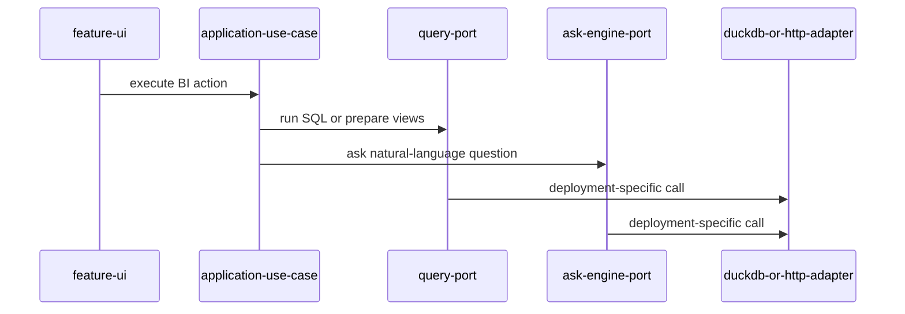

# Task: Inject query and Ask Data ports instead of global DB services

## Priority

P0 — Query execution and Ask Data are core BI behavior, and global DB access currently blocks testability and deployment flexibility.

## Dependencies

- Depends on Task 001: Map architecture boundaries and fitness rules.
- Depends on ADR `docs/adrs/001-define-clean-architecture-boundaries.md`.
- Depends on ADR `docs/adrs/003-keep-deployment-mode-as-composition-detail.md`.

## Assignability

**HITL** — requires human approval of ADR 003 before replacing global DB access because this affects deployment wiring.

## Context

Several UI and orchestration modules call `getDbService()` or instantiate `AskDataEngine` directly. That acts as a service locator and couples feature UI to query execution details. This task introduces explicit injected ports for query execution, data-source view creation, and Ask Data orchestration while preserving client-only DuckDB-WASM behavior.

## Use Cases

- **Feature**: Ask Data execution
- **Scenario**: User asks a natural-language question in client-only mode
- **Given** datasource views are available in DuckDB-WASM
- **When** the user asks "sales by region"
- **Then** the query executes through injected Ask Data and query ports rather than a global DB service

## Definition of Ready

- ADR 003 exists and records deployment mode as a composition detail.
- Current `getDbService()` call sites are listed and grouped by use case.
- A replacement port strategy exists for datasource preview, question preview, dashboard widget execution, and Ask Data orchestration.

## Functional Requirements

- `FR-001`: Replace `getDbService()` use in datasource preview with an injected query/data-source manager port.
- `FR-002`: Replace `getDbService()` and direct `AskDataEngine` construction in question preview with injected Ask Data/query ports.
- `FR-003`: Replace dashboard workspace direct DB access with injected query and Ask Data ports.
- `FR-004`: Keep DuckDB-WASM as the client-only adapter implementation.
- `FR-005`: Keep HTTP/server-backed query execution possible through the same port contracts.

## Non-Functional Requirements

- `NFR-001`: UI components must be constructible in tests without initializing DuckDB-WASM.
- `NFR-002`: The core use-case and port layer must not import `shared/services/db-service`.
- `NFR-003`: The migration must not force a server deployment or remove client-only support.

## Observability Requirements

- `OBS-001`: Query execution failures must be logged with operation type and deployment adapter name, excluding raw SQL unless explicitly enabled for development.
- `OBS-002`: Ask Data execution must record success/failure and elapsed time through the observability boundary where available.

## Acceptance Criteria

- `AC-001`: **Given** a component test with fake query ports, **When** datasource preview renders, **Then** no global DB service initialization is required.
- `AC-002`: **Given** client-only composition, **When** dashboard widgets execute SQL, **Then** DuckDB-WASM remains the underlying query adapter.
- `AC-003`: **Given** server-backed composition, **When** a query is executed, **Then** the same UI calls the HTTP query adapter through the port.
- `AC-004`: **Given** source files outside composition/adapters, **When** imports are inspected, **Then** they do not import `shared/services/db-service`.

## Required Tests

### Unit Tests

- `UT-001`: Verify datasource preview logic works with a fake query port. Covers `FR-001`, `AC-001`.
- `UT-002`: Verify question preview logic works with fake Ask Data and query ports. Covers `FR-002`.
- `UT-003`: Verify dashboard widget execution delegates through query ports. Covers `FR-003`.

### Integration Tests

- `IT-001`: **Scenario**: Client-only query execution uses DuckDB adapter  
  **Given** client-only composition is created  
  **When** a dashboard widget query runs  
  **Then** execution passes through the query port backed by DuckDB-WASM  
  Covers `FR-004`, `AC-002`.
- `IT-002`: **Scenario**: Client-server query execution uses HTTP adapter  
  **Given** client-server composition is created  
  **When** a query runs  
  **Then** execution passes through the HTTP query adapter  
  Covers `FR-005`, `AC-003`.

### Smoke Tests

- `SMK-001`: **Scenario**: Ask Data still starts in client-only mode  
  **Given** the app starts without a server  
  **When** the Ask Data UI initializes  
  **Then** it loads without a missing DB service error  
  Covers critical path availability.

### End-to-End Tests

- `E2E-001`: **Scenario**: User asks a BI question  
  **Given** a seeded datasource is available  
  **When** the user asks a natural-language sales question  
  **Then** the result is displayed in the Ask Data result UI  
  Covers `FR-002`, `FR-004`.

### Regression Tests

- `REG-001`: **Scenario**: Components no longer fail when `setDbService` is not called  
  **Given** a component test environment without global DB service initialization  
  **When** datasource, question, or dashboard components are created with fake ports  
  **Then** no `DbService not initialized` error is thrown  
  Covers previous service-locator fragility.

### Performance Tests

- `PT-001`: Not applicable — this task changes dependency wiring, not query algorithms.

### Security Tests

- `ST-001`: Verify failed query logs redact raw SQL and datasource URLs by default. Covers `OBS-001`.

### Usability Tests

- `UX-001`: Verify query failure states still show recoverable UI feedback in datasource, question, and dashboard contexts. Covers `AC-001`.

### Observability Tests

- `OT-001`: Verify Ask Data success/failure telemetry records elapsed time without logging user question text by default. Covers `OBS-002`.

## Definition of Done

- Code is implemented behind the correct domain, service, component, or adapter boundary.
- Required tests for this task pass.
- Loading, empty, validation, server error, and permission-denied states are handled where applicable.
- Required telemetry is implemented and verified.
- Required ADRs are updated from `Proposed` to `Accepted` or left with explicit open questions.
- API contracts, user-facing behavior, ADRs, or operational runbooks are documented when changed.
