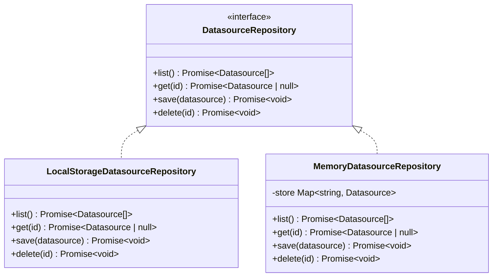

# Task: Introduce Repository Ports and LocalStorage Adapters

## Priority

P1 — Depends on core entities (Task 003). Unblocks use case creation (Task 005).

## Dependencies

- Depends on Task 003: Define Core Entities (`tasks/issues/003-define-core-entities.md`).
- Depends on ADR `docs/adrs/004-hexagonal-architecture-boundaries.md`.
- No external system dependency.

## Assignability

**AFK** — Port interfaces are fully specified. Adapter behavior is a direct wrap of existing localStorage registries with no logic rewrite.

## Context

The current feature registries (`datasource-registry.ts`, `question-registry.ts`, `dashboard-registry.ts`) call `localStorage` directly and are imported by UI components. This makes the storage layer non-replaceable and untestable without a browser environment.

This task introduces three port interfaces in `src/core/application/ports/` and three concrete adapters in `src/adapters/client/local-storage/`. Each adapter wraps the existing registry behavior without rewriting it. An in-memory adapter is also created per port to enable fast unit tests for use cases.

The registries themselves are not deleted yet — the adapters delegate to them. Full registry removal happens in Task 005 when UI components are re-wired.

Note: The dashboard registry stores `DashboardConfig` objects (YAML-based configs with `kpis`/`charts`/`tables` arrays), which are structurally incompatible with the core `Dashboard` entity. The `LocalStorageDashboardRepository` therefore operates on a separate localStorage key and does not delegate to `dashboard-registry.ts`.

The same pattern applies for `QuestionRepository` and `DashboardRepository`.

Additional ports created in this task:

| Port          | Location                                     |
| ------------- | -------------------------------------------- |
| `IdGenerator` | `src/core/application/ports/id-generator.ts` |
| `Clock`       | `src/core/application/ports/clock.ts`        |

Adapters for the utility ports:

| Adapter             | Location                                     |
| ------------------- | -------------------------------------------- |
| `CryptoIdGenerator` | `src/adapters/client/crypto-id-generator.ts` |
| `SystemClock`       | `src/adapters/client/system-clock.ts`        |

## Use Cases

- **Feature**: Replaceable persistence
- **Scenario**: Unit test uses in-memory repository
- **Given** a use case depends on `DatasourceRepository`
- **When** a test injects `MemoryDatasourceRepository`
- **Then** the test runs without `localStorage` or a browser environment

---

- **Feature**: LocalStorage adapter wraps registry
- **Scenario**: Adapter saves a datasource
- **Given** `LocalStorageDatasourceRepository` is instantiated
- **When** `save(datasource)` is called
- **Then** the datasource is persisted in `localStorage` under the existing key `persisted_datasources_v1`

## Definition of Ready

- Task 003 complete: `Datasource`, `Question`, `Dashboard`, `DashboardWidget` types available in `@/core/entities`.
- `src/core/application/ports/` directory created.
- `src/adapters/client/local-storage/` directory created.
- `src/adapters/memory/` directory created.

## Functional Requirements

- `FR-001`: `DatasourceRepository`, `QuestionRepository`, and `DashboardRepository` interfaces are defined in `src/core/application/ports/`.
- `FR-002`: `IdGenerator` port is defined with a `create(): string` method.
- `FR-003`: `Clock` port is defined with a `now(): string` method returning an ISO 8601 string.
- `FR-004`: `LocalStorageDatasourceRepository` and `LocalStorageQuestionRepository` implement the repository ports and delegate to the existing feature registries. `LocalStorageDashboardRepository` stores `Dashboard` entities directly to localStorage under a separate key (`persisted_entity_dashboards_v1`) because `DashboardConfig` (the registry's internal shape) and the core `Dashboard` entity are structurally incompatible — a lossless mapping is not possible. The legacy `persisted_dashboards_v1` key is left untouched.
- `FR-005`: `MemoryDatasourceRepository`, `MemoryQuestionRepository`, and `MemoryDashboardRepository` implement the repository ports using a `Map` — no `localStorage`.
- `FR-006`: `CryptoIdGenerator` implements `IdGenerator` using `crypto.randomUUID()`.
- `FR-007`: `SystemClock` implements `Clock` returning `new Date().toISOString()`.
- `FR-008`: `src/core/application/ports/index.ts` re-exports all port interfaces.
- `FR-009`: Adapter files import only from `@/core/entities` and `@/core/application/ports`, with one exception: `LocalStorage*Repository` adapters may also import from the feature registry they wrap, as their sole purpose is to delegate to that registry.

## Non-Functional Requirements

- `NFR-001`: The TypeScript compiler reports zero new errors after this task.
- `NFR-002`: Memory adapters do not import `localStorage`, `crypto`, or any browser API.
- `NFR-003`: LocalStorage adapters preserve the existing storage keys and serialization format so no user data is lost.

## Observability Requirements

- `OBS-001`: Not applicable — this task introduces interfaces and thin wrappers with no new observable behavior.

## Acceptance Criteria

- `AC-001`: **Given** `MemoryDatasourceRepository`, **When** `save(d)` then `get(d.id)` is called, **Then** the same datasource is returned without touching `localStorage`.
- `AC-002`: **Given** `LocalStorageDatasourceRepository`, **When** `save(d)` is called, **Then** `localStorage.getItem('persisted_datasources_v1')` contains the datasource.
- `AC-003`: **Given** `src/core/application/ports/` files, **When** linted, **Then** no imports from `adapters`, `features`, `infra`, or `shared/ui` appear.
- `AC-004`: **Given** the full codebase, **When** TypeScript compiles, **Then** zero errors are reported.

## Required Tests

### Unit Tests

- `UT-001`: `MemoryDatasourceRepository.save()` then `list()` returns the saved datasource. Covers `FR-005`, `AC-001`.
- `UT-002`: `MemoryDatasourceRepository.delete(id)` removes the datasource. Covers `FR-005`.
- `UT-003`: `MemoryQuestionRepository` and `MemoryDashboardRepository` pass the same save/get/delete cycle. Covers `FR-005`.
- `UT-004`: `CryptoIdGenerator.create()` returns a non-empty string with no repeated values across 100 calls. Covers `FR-006`.
- `UT-005`: `SystemClock.now()` returns a valid ISO 8601 string. Covers `FR-007`.

### Integration Tests

- `IT-001`: **Scenario**: LocalStorage adapter round-trips a datasource  
  **Given** a fresh `LocalStorageDatasourceRepository` backed by a real `localStorage` mock  
  **When** `save(datasource)` then `list()` is called  
  **Then** the datasource appears in the list  
  **And** `localStorage.getItem('persisted_datasources_v1')` contains the serialized datasource  
  Covers `FR-004`, `AC-002`.

### Smoke Tests

Not applicable — no entry-point or deployment artifact change in this task.

### End-to-End Tests

Not applicable — no user-visible behavior changes.

### Regression Tests

Not applicable — no known previous defect in this area.

### Performance Tests

Not applicable — this task introduces thin wrapper classes with no algorithmic change.

### Security Tests

Not applicable — no new trust boundary or external input introduced.

### Usability Tests

Not applicable — no user-facing changes.

### Observability Tests

Not applicable — no telemetry changes.

## Definition of Done

- Port interfaces and all adapters exist at the paths specified above.
- `UT-001` through `UT-005` and `IT-001` pass.
- `tsc --noEmit` reports zero errors.
- ADR `docs/adrs/004-hexagonal-architecture-boundaries.md` remains linked.
