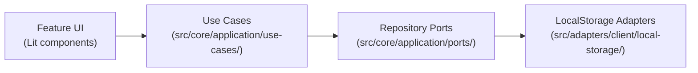

# Task: Create CRUD Use Cases and Wire UI

## Priority

P2 — Depends on Tasks 003 and 004. Unblocks Task 007 (composition containers) by proving the use case layer before wiring everything.

## Dependencies

- Depends on Task 003: Define Core Entities (`tasks/issues/003-define-core-entities.md`).
- Depends on Task 004: Introduce Repository Ports and Adapters (`tasks/issues/004-introduce-repository-ports-and-adapters.md`).
- No ADR dependency; this task uses existing architecture.

## Assignability

**AFK** — All 15 use case behaviors are fully specified. Input/output shapes are derivable from existing registry signatures. No irreversible architectural decision remains open.

## Context

The app's Lit components currently call the feature registries directly (e.g., `datasourceList()`, `addDatasource()`). After this task, the UI receives use cases from outside (via a temporary inline wiring that will be replaced by the composition containers in Task 007) and calls them instead.

Fifteen use cases are created — five per aggregate (datasource, question, dashboard):



Each use case class follows this pattern:

```typescript
export class CreateDatasource {
  constructor(
    private readonly datasources: DatasourceRepository,
    private readonly idGenerator: IdGenerator,
    private readonly clock: Clock,
  ) {}

  async execute(input: CreateDatasourceInput): Promise<Datasource> { ... }
}
```

Use case classes depend **only** on entity types and port interfaces — zero infrastructure imports.

The temporary wiring in this task instantiates use cases directly inside the Lit component or a thin model file using `new LocalStorageDatasourceRepository()`. Task 007 will replace this with the composition container.

## Use Cases

- **Feature**: Datasource management via use cases
- **Scenario**: User creates a new datasource
- **Given** the user opens the datasource editor
- **When** they submit a valid datasource form
- **Then** `CreateDatasource.execute()` is called with the form input
- **And** the new datasource appears in the datasource list

---

- **Feature**: Question management via use cases
- **Scenario**: User deletes a question
- **Given** the user views the question list
- **When** they click "Delete" on a question
- **Then** `DeleteQuestion.execute(id)` is called
- **And** the question no longer appears in the list

---

- **Feature**: Dashboard management via use cases
- **Scenario**: User updates a dashboard
- **Given** the user edits a dashboard title
- **When** they save the change
- **Then** `UpdateDashboard.execute(id, patch)` is called
- **And** the dashboard displays the new title

## Definition of Ready

- Task 003 complete: entity types available at `@/core/entities`.
- Task 004 complete: port interfaces and LocalStorage adapters available.
- `IdGenerator` and `Clock` ports available from Task 004.
- Use case input/output shapes defined in this task (below).

## Functional Requirements

- `FR-001`: The following 15 use case classes exist in `src/core/application/use-cases/`:
  - `datasources/`: `CreateDatasource`, `UpdateDatasource`, `DeleteDatasource`, `GetDatasource`, `ListDatasources`
  - `questions/`: `CreateQuestion`, `UpdateQuestion`, `DeleteQuestion`, `GetQuestion`, `ListQuestions`
  - `dashboards/`: `CreateDashboard`, `UpdateDashboard`, `DeleteDashboard`, `GetDashboard`, `ListDashboards`
- `FR-002`: Each `Create*` use case accepts a plain input object (no `id`, `createdAt`, `updatedAt`) and returns the created entity with generated `id` and timestamps.
- `FR-003`: Each `Update*` use case accepts `id` and a partial patch object, updates `updatedAt`, and returns the updated entity. It throws a domain error if the entity does not exist.
- `FR-004`: Each `Delete*` use case accepts `id` and returns `void`. It is a no-op if the entity does not exist.
- `FR-005`: Each `Get*` use case accepts `id` and returns the entity or `null`.
- `FR-006`: Each `List*` use case returns an array of all entities (empty array when none exist).
- `FR-007`: Use case files import only from `@/core/entities` and `@/core/application/ports` — no imports from `adapters`, `features`, `infra`, or `shared/ui`.
- `FR-008`: Lit UI components for datasource, question, and dashboard are updated to call use cases instead of registry functions directly.
- `FR-009`: The temporary wiring (instantiating use cases with concrete adapters) is co-located with the Lit component or a sibling model file, and is clearly marked as temporary until Task 007.

## Non-Functional Requirements

- `NFR-001`: The TypeScript compiler reports zero new errors after this task.
- `NFR-002`: Use case execution time for in-memory adapters is under 5 ms for any single operation.
- `NFR-003`: The UI continues to render the same user-facing behavior as before this task (datasource list, question list, dashboard list all work).

## Observability Requirements

- `OBS-001`: Not applicable — CRUD use cases for local data have no telemetry requirements in this task.

## Acceptance Criteria

- `AC-001`: **Given** an empty in-memory repository, **When** `CreateDatasource.execute({ name: 'Sales', type: 'csv', ... })` is called, **Then** the returned datasource has a non-empty `id`, `createdAt`, and `updatedAt`.
- `AC-002`: **Given** a datasource exists, **When** `UpdateDatasource.execute(id, { name: 'New Name' })` is called, **Then** the stored datasource has `name: 'New Name'` and an updated `updatedAt`.
- `AC-003`: **Given** a datasource exists, **When** `DeleteDatasource.execute(id)` is called, **Then** `GetDatasource.execute(id)` returns `null`.
- `AC-004`: **Given** the app is running with LocalStorage adapters, **When** a user creates a datasource through the UI, **Then** the datasource persists across page reloads.
- `AC-005`: **Given** `src/core/application/use-cases/` files, **When** linted, **Then** no imports from `adapters`, `features`, or `infra` appear.

## Required Tests

### Unit Tests

- `UT-001`: `CreateDatasource.execute()` with a `MemoryDatasourceRepository` returns an entity with `id`, `createdAt`, `updatedAt`. Covers `FR-002`, `AC-001`.
- `UT-002`: `UpdateDatasource.execute()` throws when the datasource does not exist. Covers `FR-003`.
- `UT-003`: `UpdateDatasource.execute()` updates `updatedAt` and the patched fields. Covers `FR-003`, `AC-002`.
- `UT-004`: `DeleteDatasource.execute()` removes the entity; subsequent `GetDatasource.execute()` returns `null`. Covers `FR-004`, `AC-003`.
- `UT-005`: Same create/update/delete cycle verified for `Question` and `Dashboard`. Covers `FR-001`.
- `UT-006`: `ListDatasources.execute()` returns an empty array when no datasources exist. Covers `FR-006`.

### Integration Tests

- `IT-001`: **Scenario**: Datasource survives a localStorage round-trip via use cases  
  **Given** `CreateDatasource` is wired to `LocalStorageDatasourceRepository`  
  **When** `execute({ name: 'Sales', type: 'csv', ... })` is called  
  **Then** `ListDatasources.execute()` returns the created datasource  
  **And** `localStorage.getItem('persisted_datasources_v1')` is non-empty  
  Covers `FR-008`, `AC-004`.

### Smoke Tests

- `SMK-001`: **Scenario**: Datasource list UI still loads after use case wiring  
  **Given** the app is built  
  **When** the datasource list page is opened  
  **Then** it renders without a JavaScript error  
  Covers `NFR-003`.

### End-to-End Tests

Not applicable — the user journey is identical before and after this refactoring. No new user-facing behavior is introduced.

### Regression Tests

Not applicable — no known previous defect in this area.

### Performance Tests

Not applicable — in-memory use case operations are trivially fast.

### Security Tests

Not applicable — no new trust boundary or external input. Existing localStorage isolation is unchanged.

### Usability Tests

Not applicable — no user-facing changes; behavior is preserved.

### Observability Tests

Not applicable — no telemetry changes.

## Definition of Done

- All 15 use case classes exist and pass `UT-001` through `UT-006` and `IT-001`.
- `SMK-001` passes.
- UI components for datasource, question, and dashboard call use cases — no direct registry imports remain in Lit component files.
- `tsc --noEmit` reports zero errors.
- Temporary wiring is clearly marked with a `// TODO(task-007): replace with composition container` comment.
