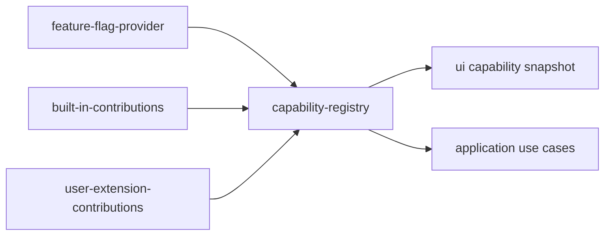

# Task: Add capability registry and feature flag evaluation

## Priority

P1 — Required for controlled extensibility and optional BI capabilities without scattering deployment or feature conditionals.

## Dependencies

- Depends on Task 002: Define BI platform contracts and capabilities.
- Depends on Task 003: Unify Datasource, Question, and Dashboard persistence behind use cases.
- Depends on ADR `docs/adrs/002-establish-bi-extension-platform.md`.
- Depends on ADR `docs/adrs/004-standardize-feature-flags-and-observability-boundaries.md`.

## Assignability

**HITL** — requires human approval of initial flag sources and default capability policy in ADR 004.

## Context

Feature flags should control availability of capabilities such as datasource types, visualizations, semantic matching strategies, exporters, and experimental Ask Data behavior. The UI should ask what capabilities are available rather than importing concrete implementations or checking deployment mode.

## Use Cases

- **Feature**: Capability flagging
- **Scenario**: Operator disables an experimental visualization
- **Given** a visualization capability is registered behind a feature flag
- **When** the flag is disabled
- **Then** the visualization is unavailable in UI selection and cannot be selected through application flows

## Definition of Ready

- Task 002 platform contracts exist.
- ADR 004 records initial flag source and default behavior.
- At least one built-in contribution is selected as the tracer capability.

## Functional Requirements

- `FR-001`: Add a feature flag provider port with an in-memory/static adapter for current client-only use.
- `FR-002`: Add capability resolution that combines registered contributions with flag evaluation.
- `FR-003`: Expose a read-only capability snapshot to UI components and application flows.
- `FR-004`: Migrate at least one datasource type and one visualization type to read availability from capabilities.
- `FR-005`: Keep existing defaults enabled unless explicitly disabled.

## Non-Functional Requirements

- `NFR-001`: Flag checks must be centralized in capability resolution, not scattered across UI components.
- `NFR-002`: Capability lookup must be deterministic and testable without browser APIs.
- `NFR-003`: Disabled capability behavior must fail closed with a clear domain error instead of silently falling back to an unrelated capability.

## Observability Requirements

- `OBS-001`: Emit or log capability registration failures with capability ID and contribution type.
- `OBS-002`: Emit or log disabled capability access attempts with capability ID and caller context, without user-entered data.

## Acceptance Criteria

- `AC-001`: **Given** a flag-disabled visualization, **When** the widget editor lists visualization choices, **Then** the disabled visualization is not offered.
- `AC-002`: **Given** a disabled datasource connector, **When** creation is attempted through an application flow, **Then** a clear capability-disabled error is returned.
- `AC-003`: **Given** no flag configuration, **When** default client-only composition starts, **Then** existing datasource and visualization behavior remains available.
- `AC-004`: **Given** two deployments with different flag adapters, **When** capabilities are resolved, **Then** each deployment receives its own deterministic capability snapshot.

## Required Tests

### Unit Tests

- `UT-001`: Verify feature flag provider returns defaults when no explicit value exists. Covers `FR-001`, `FR-005`.
- `UT-002`: Verify capability registry excludes disabled capabilities. Covers `FR-002`, `AC-001`.
- `UT-003`: Verify disabled capability access returns a stable domain error. Covers `NFR-003`, `AC-002`.

### Integration Tests

- `IT-001`: **Scenario**: Client-only capabilities resolve through composition  
  **Given** built-in datasource and visualization contributions  
  **When** client-only composition starts  
  **Then** enabled capabilities are available to UI through a read-only snapshot  
  Covers `FR-003`, `AC-003`.

### Smoke Tests

- `SMK-001`: **Scenario**: Default capabilities load  
  **Given** no external flag configuration  
  **When** the app starts  
  **Then** dashboard, datasource, and question screens still load  
  Covers `FR-005`.

### End-to-End Tests

- `E2E-001`: Not applicable — the tracer migration is capability availability, not a full new user journey.

### Regression Tests

- `REG-001`: **Scenario**: Existing chart defaults remain enabled  
  **Given** default client-only flags  
  **When** the dashboard widget editor opens  
  **Then** existing chart types used by seed dashboards remain available  
  Covers compatibility risk.

### Performance Tests

- `PT-001`: Not applicable — capability resolution is small in-memory configuration.

### Security Tests

- `ST-001`: Verify capability snapshots do not expose hidden flag values, secrets, or adapter configuration. Covers `FR-003`.

### Usability Tests

- `UX-001`: Verify disabled capabilities do not appear as selectable options in affected UI controls. Covers `AC-001`.

### Observability Tests

- `OT-001`: Verify registration failures and disabled-capability access attempts are logged or emitted with redacted context. Covers `OBS-001`, `OBS-002`.

## Definition of Done

- Code is implemented behind the correct domain, service, component, or adapter boundary.
- Required tests for this task pass.
- Loading, empty, validation, server error, and permission-denied states are handled where applicable.
- Required telemetry is implemented and verified.
- Required ADRs are updated from `Proposed` to `Accepted` or left with explicit open questions.
- API contracts, user-facing behavior, ADRs, or operational runbooks are documented when changed.
