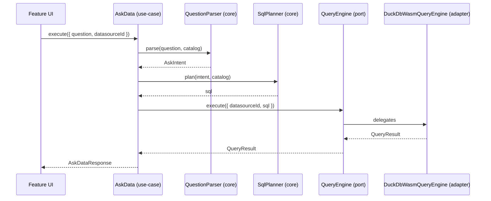

# Task: Extract AskData Use Case and QueryEngine Port

## Priority

P2 — Depends on Task 004 (ports). Can run in parallel with Task 005 after Task 004 completes.

## Dependencies

- Depends on Task 003: Define Core Entities (`tasks/issues/003-define-core-entities.md`).
- Depends on Task 004: Introduce Repository Ports and Adapters (`tasks/issues/004-introduce-repository-ports-and-adapters.md`).
- Depends on ADR `docs/adrs/004-hexagonal-architecture-boundaries.md`.

## Assignability

**HITL** — The classification of which ask model files belong in `core` vs. `adapters` requires architectural judgment for files that use browser-specific APIs (e.g., `semantic-field-matcher.ts` loads ONNX models via `transformers.js`). Human must confirm the placement boundary before implementation begins.

**Decision point**: Confirm which of the 40 ask model files are deployment-agnostic (→ `core`) vs. browser/model-specific (→ `adapters`). Proposed split is documented below.

## Context

The current ask feature has a deep model layer (`src/features/ask/model/`, 40 files, ~10,800 lines) and an orchestration layer (`src/features/ask/orchestration/`). The `AskDataEngine` class in `ask-data.ts` directly references `DuckDBManager` and `DataSourceManager` from `src/infra/`, making it impossible to run the ask logic against a different query engine without touching the engine source.

This task splits the ask orchestration into:

1. A **use case** (`AskData`) in `src/core/application/use-cases/ask-data/` that depends only on ports.
2. A **QueryEngine port** in `src/core/application/ports/query-engine.ts`.
3. A **DuckDB-WASM adapter** in `src/adapters/client/duckdb-wasm/` implementing the port.
4. **Pure helper files** promoted to `src/core/application/use-cases/ask-data/` (or a shared `src/core/ask/` subfolder).

**Proposed file classification:**

| File                                             | Proposed location             | Reason                                                                     |
| ------------------------------------------------ | ----------------------------- | -------------------------------------------------------------------------- |
| `question-parser.ts`                             | `core`                        | Pure NL parsing, no browser API                                            |
| `sql-planner.ts`                                 | `core`                        | Pure SQL planning                                                          |
| `sql-renderer.ts`                                | `core`                        | Pure SQL string building                                                   |
| `result-analysis.ts`                             | `core`                        | Pure result shaping                                                        |
| `result-analyzer.ts`                             | `core`                        | Pure result pattern analysis                                               |
| `catalog-builder.ts`                             | `core`                        | Pure field profiling                                                       |
| `semantic-modeling.ts`                           | `core`                        | Pattern-based role detection, no browser API                               |
| `narrative-generator.ts`                         | `core`                        | Pure text generation                                                       |
| `intent-describer.ts`                            | `core`                        | Pure intent formatting                                                     |
| `date-range-parser.ts`                           | `core`                        | Pure date parsing (chrono-node)                                            |
| `vocabulary.ts`                                  | `core`                        | Pure bilingual dictionaries                                                |
| `term-matcher.ts`                                | `core`                        | Pure regex matching                                                        |
| `field-search.ts`                                | `core`                        | MiniSearch (runs in Node and browser)                                      |
| `semantic-field-matcher.ts`                      | `core`                        | ONNX via transformers.js — runs in Node too; confirmed deployment-agnostic |
| `value-filter-resolver.ts`                       | `core`                        | Pure resolver with Fuse.js                                                 |
| `ask-data.ts` (AskDataEngine)                    | `core/use-cases`              | Main use case class (refactored)                                           |
| `infra/db/db.ts`                                 | `adapters/client/duckdb-wasm` | Browser WASM — adapter                                                     |
| `infra/data-sources/data-source-manager.ts`      | `adapters/client/duckdb-wasm` | DuckDB-specific — adapter                                                  |
| `orchestration/create-dashboard-orchestrator.ts` | `adapters/client/duckdb-wasm` | Wires DuckDB — adapter                                                     |

The `AskOrchestrator` in `ask-orchestrator.ts` becomes the `AskData` use case constructor. The lazy engine init pattern is preserved.

## Use Cases

- **Feature**: Ask-data with replaceable query engine
- **Scenario**: Unit test uses a mock query engine
- **Given** `AskData` use case is instantiated with `MemoryQueryEngine` returning fixed rows
- **When** `execute({ question: 'total sales', datasourceId: 'ds-1' })` is called
- **Then** a valid `AskDataResponse` is returned without loading DuckDB WASM

---

- **Feature**: Ask-data in the browser
- **Scenario**: User asks a natural language question
- **Given** the app is wired with `DuckDbWasmQueryEngine`
- **When** the user submits "Show me top 5 products by revenue"
- **Then** the ask feature returns a ranked result with the correct chart type

## Definition of Ready

- Task 003 complete: `AskDataConfig`, `AskDataResponse`, `QueryResult` types available at `@/core/entities`.
- Task 004 complete: `DatasourceRepository` and `QuestionRepository` ports available.
- `QueryEngine` port shape approved: `execute({ datasourceId, sql }) → Promise<QueryResult>`.
- Human has confirmed the file classification table above (HITL checkpoint).

## Functional Requirements

- `FR-001`: `QueryEngine` port is defined in `src/core/application/ports/query-engine.ts` with `execute(input: { datasourceId: string; sql: string }): Promise<QueryResult>`.
- `FR-002`: `AskData` use case exists in `src/core/application/use-cases/ask-data/ask-data.ts` and depends only on `DatasourceRepository`, `QuestionRepository`, `QueryEngine`, and pure helper modules in `core`.
- `FR-003`: `DuckDbWasmQueryEngine` implements `QueryEngine` in `src/adapters/client/duckdb-wasm/duckdb-query-engine.ts` and wraps the existing `duckDBManager` singleton.
- `FR-004`: All pure ask helper files listed in the table above are moved to `src/core/application/use-cases/ask-data/` or a `src/core/ask/` subfolder.
- `FR-005`: `src/adapters/client/duckdb-wasm/` contains the DuckDB WASM manager, data source manager, and query engine adapter.
- `FR-006`: The `src/infra/db/` and `src/infra/data-sources/` directories no longer export anything imported directly by features or use cases — only by the duckdb-wasm adapter.
- `FR-007`: The ask feature UI (`src/features/ask/ui/`) calls `AskData.execute()` instead of `AskOrchestrator` directly.
- `FR-008`: A `MemoryQueryEngine` test adapter exists in `src/adapters/memory/memory-query-engine.ts` returning configurable fixed results.

## Non-Functional Requirements

- `NFR-001`: The TypeScript compiler reports zero new errors after this task.
- `NFR-002`: The ask feature continues to produce correct SQL and chart results for the existing demo datasources after the refactoring.
- `NFR-003`: The `AskData` use case must not import `duckdb-wasm`, `@duckdb/duckdb-wasm`, or any browser WASM API.

## Observability Requirements

- `OBS-001`: Not applicable — observability for the ask feature is unchanged by this structural refactoring.

## Acceptance Criteria

- `AC-001`: **Given** `AskData` instantiated with `MemoryQueryEngine`, **When** `execute({ question: 'count rows', datasourceId: 'x' })` is called, **Then** a result is returned without throwing and without loading WASM.
- `AC-002`: **Given** `src/core/application/use-cases/ask-data/ask-data.ts`, **When** linted, **Then** no import from `@duckdb/duckdb-wasm`, `infra/db`, or `adapters` appears.
- `AC-003`: **Given** the app running in the browser with `DuckDbWasmQueryEngine`, **When** a user submits a natural language question, **Then** the existing behavior is preserved (correct SQL generated, chart rendered).
- `AC-004`: **Given** the full codebase, **When** TypeScript compiles, **Then** zero errors are reported.

## Required Tests

### Unit Tests

- `UT-001`: `AskData.execute()` with `MemoryQueryEngine` and `MemoryDatasourceRepository` returns a valid `AskDataResponse`. Covers `FR-002`, `AC-001`.
- `UT-002`: `AskData.execute()` does not call `DuckDbWasmQueryEngine` when a `MemoryQueryEngine` is injected. Covers `NFR-003`.
- `UT-003`: `QuestionParser.parse()` returns a valid `AskIntent` for "top 5 products by revenue". Covers `FR-004`.
- `UT-004`: `SqlPlanner.plan()` produces valid SQL for a KPI intent with a single measure. Covers `FR-004`.

### Integration Tests

- `IT-001`: **Scenario**: AskData produces results end-to-end with MemoryQueryEngine  
  **Given** `AskData` is wired with `MemoryDatasourceRepository` (containing one datasource) and `MemoryQueryEngine` (returning `{ columns: ['total'], rows: [{ total: 42 }] }`)  
  **When** `execute({ question: 'total sales', datasourceId: 'ds-1' })` is called  
  **Then** the returned `AskDataResponse` contains a non-empty result  
  Covers `FR-002`, `AC-001`.

### Smoke Tests

- `SMK-001`: **Scenario**: App builds and ask feature loads after refactoring  
  **Given** all imports are updated  
  **When** `vite build` completes  
  **Then** it exits with code 0 and the ask feature chunk is present  
  Covers `AC-003`.

### End-to-End Tests

Not applicable — the user-facing ask flow is identical before and after this refactoring.

### Regression Tests

- `REG-001`: **Scenario**: Existing ask model unit tests continue to pass  
  **Given** the pure helper files are moved to their new locations  
  **When** the existing spec files for `question-parser`, `sql-planner`, `catalog-builder` are run  
  **Then** all previously passing tests still pass  
  Covers `NFR-002`.

### Performance Tests

Not applicable — this task is structural; no algorithmic change to the ask engine.

### Security Tests

Not applicable — no new trust boundary; DuckDB runs client-side as before.

### Usability Tests

Not applicable — no user-facing changes.

### Observability Tests

Not applicable — no telemetry changes.

## Definition of Done

- `AskData` use case, `QueryEngine` port, and `DuckDbWasmQueryEngine` adapter exist at specified paths.
- `UT-001` through `UT-004`, `IT-001`, `SMK-001`, and `REG-001` pass.
- `tsc --noEmit` reports zero errors.
- `src/core/application/use-cases/ask-data/ask-data.ts` imports no WASM, infra, or adapter code.
- Human has confirmed and signed off on the file classification table at the HITL checkpoint.
- ADR `docs/adrs/004-hexagonal-architecture-boundaries.md` updated with confirmed ask-model classification.
