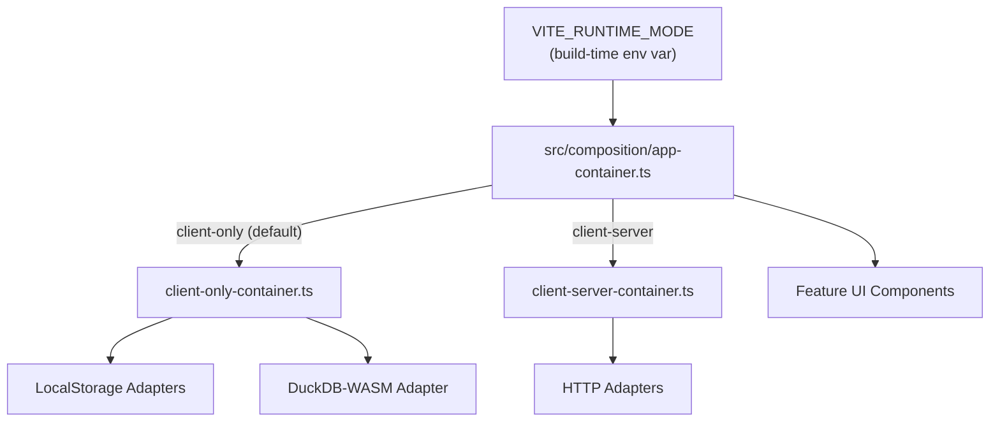

# Task: Add Composition Containers and Runtime Wiring

## Priority

P3 — Depends on Tasks 005 and 006. This is the final wiring task — it removes the temporary adapter instantiation added in Task 005 and replaces it with a real container.

## Dependencies

- Depends on Task 005: Create CRUD Use Cases (`tasks/issues/005-create-crud-use-cases.md`).
- Depends on Task 006: Extract AskData Use Case (`tasks/issues/006-extract-ask-data-use-case.md`).
- Depends on ADR `docs/adrs/005-runtime-deployment-mode-selection.md` — the container selection mechanism must be resolved before this task begins.

## Assignability

**HITL** — Requires human approval of ADR `docs/adrs/005-runtime-deployment-mode-selection.md` before the container selection mechanism can be implemented. Once the ADR is accepted, the task is fully mechanical.

**Decision point**: ADR 005 must be moved from `Proposed` to `Accepted` before implementation starts.

## Context

Tasks 003–006 introduce clean use cases, ports, and adapters, but leave temporary inline wiring in the Lit components (marked `// TODO(task-007)`). This task creates the composition root — a single location where concrete adapters are injected into use cases — and removes all temporary wiring.

The `app-container.ts` module reads `import.meta.env.VITE_RUNTIME_MODE` and exports a single container object. The `src/app/main.ts` entry point imports this container and passes use cases down to feature components via a dependency-injection mechanism compatible with Lit (likely attribute or context provider pattern).

The client-server container uses HTTP adapter stubs in this task — the actual server-side implementation is out of scope.

## Use Cases

- **Feature**: Single composition root
- **Scenario**: Developer switches to client-server mode
- **Given** the environment variable `VITE_RUNTIME_MODE=client-server` is set
- **When** the app is built
- **Then** all use cases use HTTP adapters pointing to `/api/*` endpoints
- **And** no `localStorage` calls are made

---

- **Feature**: Default client-only mode
- **Scenario**: Developer runs the app locally without configuration
- **Given** `VITE_RUNTIME_MODE` is not set
- **When** the app starts
- **Then** all use cases use `LocalStorage` adapters and `DuckDbWasmQueryEngine`

## Definition of Ready

- ADR `docs/adrs/005-runtime-deployment-mode-selection.md` is accepted.
- Tasks 005 and 006 are complete: all use cases exist and Lit components call them.
- Temporary wiring (`// TODO(task-007)`) comments are present and locatable.
- The Lit dependency injection pattern for passing use cases to components is decided (attribute, context, or singleton module).

## Functional Requirements

- `FR-001`: `src/composition/client-only-container.ts` creates and exports all use cases wired with `LocalStorage*Repository`, `CryptoIdGenerator`, `SystemClock`, and `DuckDbWasmQueryEngine`.
- `FR-002`: `src/composition/client-server-container.ts` creates and exports all use cases wired with `Http*Repository` stubs pointing to `/api/datasources`, `/api/questions`, `/api/dashboards`, and `HttpQueryEngine` stub at `/api/query`.
- `FR-003`: `src/composition/app-container.ts` reads `import.meta.env.VITE_RUNTIME_MODE` and re-exports the correct container. Defaults to `client-only` when the variable is absent or unrecognized.
- `FR-004`: `src/app/main.ts` imports from `src/composition/app-container.ts` — not from any adapter directly.
- `FR-005`: All `// TODO(task-007)` temporary wiring comments are removed.
- `FR-006`: No Lit component file imports directly from `src/adapters/`, `src/infra/`, or any registry file. **Implementation note**: direct infra imports in dashboard-workspace, datasource-editor-panel, and question-editor-panel are wrapped behind `src/infra/infra-service.ts` (a thin re-export shim); full container-provided QueryEngine wiring for these components is deferred to Task 008.
- `FR-007`: `Http*Repository` stubs exist in `src/adapters/http/` and implement the port interfaces. They make `fetch` calls to configurable base URLs and throw `NotImplementedError` for endpoints not yet backed by a server.

## Non-Functional Requirements

- `NFR-001`: The TypeScript compiler reports zero new errors after this task.
- `NFR-002`: A production build with `VITE_RUNTIME_MODE=client-server` must not include the DuckDB WASM bundle in its output (tree-shaken).
- `NFR-003`: A production build without `VITE_RUNTIME_MODE` must not include HTTP adapter code in the critical path.

## Observability Requirements

- `OBS-001`: Not applicable — container selection is a build-time concern with no telemetry surface.

## Acceptance Criteria

- `AC-001`: **Given** `VITE_RUNTIME_MODE` is not set, **When** the app starts, **Then** `ListDatasources.execute()` returns datasources from `localStorage`.
- `AC-002`: **Given** `VITE_RUNTIME_MODE=client-server`, **When** the app builds, **Then** the bundle contains no reference to `localStorage` in the use-case path.
- `AC-003`: **Given** the full codebase, **When** TypeScript compiles, **Then** zero errors are reported.
- `AC-004`: **Given** `src/features/*/ui/` files, **When** linted, **Then** no import from `src/adapters/`, `src/infra/`, or registry files appears.

## Required Tests

### Unit Tests

- `UT-001`: `createClientOnlyContainer()` returns a container where `listDatasources` is an instance of `ListDatasources` with `LocalStorageDatasourceRepository`. Covers `FR-001`.
- `UT-002`: `createClientServerContainer()` returns a container where `listDatasources` is an instance of `ListDatasources` with `HttpDatasourceRepository`. Covers `FR-002`.

### Integration Tests

- `IT-001`: **Scenario**: Client-only container round-trips a datasource  
  **Given** `createClientOnlyContainer()` is called in a test with a `localStorage` mock  
  **When** `container.createDatasource.execute({ name: 'Test', ... })` then `container.listDatasources.execute()` is called  
  **Then** the created datasource appears in the list  
  Covers `FR-001`, `AC-001`.

### Smoke Tests

- `SMK-001`: **Scenario**: App starts in client-only mode  
  **Given** the app is built without `VITE_RUNTIME_MODE`  
  **When** the browser opens the app  
  **Then** the datasource list renders without JavaScript errors  
  Covers `AC-001`.

### End-to-End Tests

Not applicable — user-visible behavior is identical before and after this task.

### Regression Tests

Not applicable — no known previous defect in this area.

### Performance Tests

- `PT-001`: Verify `vite build --mode client-server` produces a bundle where the WASM import is absent. Covers `NFR-002`.

### Security Tests

Not applicable — composition is internal wiring with no new trust boundary.

### Usability Tests

Not applicable — no user-facing changes.

### Observability Tests

Not applicable — no telemetry changes.

## Definition of Done

- `client-only-container.ts`, `client-server-container.ts`, and `app-container.ts` exist.
- `UT-001`, `UT-002`, `IT-001`, `SMK-001` pass.
- No `// TODO(task-007)` comments remain in the codebase.
- No Lit component file imports from `src/adapters/` or `src/infra/` directly.
- `tsc --noEmit` reports zero errors.
- ADR `docs/adrs/005-runtime-deployment-mode-selection.md` updated to `Accepted`.
