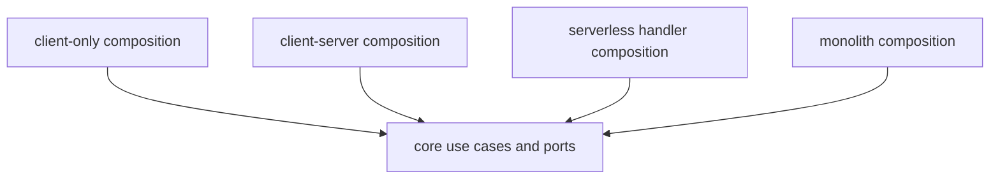

# Task: Add deployment composition contracts

## Priority

P1 — Required to keep client-only support while opening client-server, serverless, monolith, and microservice deployment options.

## Dependencies

- Depends on Task 003: Unify Datasource, Question, and Dashboard persistence behind use cases.
- Depends on Task 004: Inject query and Ask Data ports instead of global DB services.
- Depends on Task 006: Add capability registry and feature flag evaluation.
- Depends on ADR `docs/adrs/003-keep-deployment-mode-as-composition-detail.md`.

## Assignability

**HITL** — requires human approval of which deployment modes receive first-class CI coverage now.

## Context

The code already has `client-only` and `client-server` containers, but the contract between delivery modes and use cases is implicit. This task defines deployment composition contracts and proves that client-only, HTTP-backed, and serverless-style entrypoints can call the same application boundary.

## Use Cases

- **Feature**: Deployment portability
- **Scenario**: Team deploys the same BI capability in different topologies
- **Given** the Datasource, Question, Dashboard, Query, and Ask Data contracts are stable
- **When** the app is composed for client-only or server-backed runtime
- **Then** the same UI/application boundary is used with different adapters

## Definition of Ready

- Task 004 has removed global DB service dependency from feature UI.
- Task 006 exposes capabilities through composition.
- ADR 003 exists and records deployment mode as an adapter/composition concern.

## Functional Requirements

- `FR-001`: Define a typed `ApplicationComposition` contract that exposes use cases, query/ask ports, capability snapshots, and observability boundaries.
- `FR-002`: Update client-only composition to satisfy the contract with browser/local adapters.
- `FR-003`: Update client-server composition to satisfy the same contract with HTTP/read/query adapters.
- `FR-004`: Add a serverless-style composition example or test harness that invokes at least one use case without browser APIs.
- `FR-005`: Document how monolith and microservice deployments map to the same contracts without implementing production extraction.

## Non-Functional Requirements

- `NFR-001`: Core use cases must not inspect `VITE_RUNTIME_MODE` or deployment-specific environment variables.
- `NFR-002`: Composition contracts must avoid optional write methods where possible; unsupported operations should be represented by explicit capabilities.
- `NFR-003`: Deployment examples must not require external network services in tests.

## Observability Requirements

- `OBS-001`: Composition startup must log selected deployment mode and enabled capability IDs without secrets.
- `OBS-002`: Serverless-style entrypoint failures must include operation name and correlation ID when available.

## Acceptance Criteria

- `AC-001`: **Given** client-only mode, **When** composition is created, **Then** it exposes create/read/update/delete catalog use cases and DuckDB-backed query execution.
- `AC-002`: **Given** client-server mode, **When** composition is created, **Then** it exposes read/query capabilities backed by HTTP adapters and accurately reports unsupported write capabilities.
- `AC-003`: **Given** a serverless-style handler test, **When** it invokes a use case with memory adapters, **Then** the same core contract is used without browser APIs.
- `AC-004`: **Given** runtime mode selection, **When** an unknown mode is configured, **Then** startup falls back or fails according to documented policy.

## Required Tests

### Unit Tests

- `UT-001`: Verify composition contract type helpers distinguish supported and unsupported capabilities. Covers `FR-001`, `NFR-002`.
- `UT-002`: Verify runtime mode parsing handles known and unknown values deterministically. Covers `AC-004`.

### Integration Tests

- `IT-001`: **Scenario**: Client-only composition satisfies application contract  
  **Given** browser-compatible fake storage and query adapters  
  **When** client-only composition starts  
  **Then** catalog and query use cases are available  
  Covers `FR-002`, `AC-001`.
- `IT-002`: **Scenario**: Client-server composition satisfies application contract  
  **Given** fake HTTP responses  
  **When** client-server composition starts  
  **Then** read/query use cases are available and write capabilities are not advertised  
  Covers `FR-003`, `AC-002`.
- `IT-003`: **Scenario**: Serverless handler invokes a core use case  
  **Given** memory adapters  
  **When** a serverless-style handler calls a use case  
  **Then** the result is returned through the same application contract  
  Covers `FR-004`, `AC-003`.

### Smoke Tests

- `SMK-001`: **Scenario**: Client-only app starts after composition changes  
  **Given** default environment configuration  
  **When** the app loads  
  **Then** the shell renders without composition errors  
  Covers release confidence.

### End-to-End Tests

- `E2E-001`: Not applicable — this task changes composition contracts, not a new user journey.

### Regression Tests

- `REG-001`: **Scenario**: Unknown runtime mode behavior remains deterministic  
  **Given** an unsupported runtime mode value  
  **When** app composition starts  
  **Then** documented fallback or failure behavior occurs  
  Covers existing runtime mode warning behavior.

### Performance Tests

- `PT-001`: Not applicable — composition startup is not expected to be performance-sensitive in this task.

### Security Tests

- `ST-001`: Verify startup logs do not expose endpoint secrets, datasource URLs, tokens, or full configuration objects. Covers `OBS-001`.

### Usability Tests

- `UX-001`: Verify unsupported write capabilities do not render as clickable UI actions in read-only deployment mode. Covers `AC-002`.

### Observability Tests

- `OT-001`: Verify composition startup logs selected deployment mode and enabled capability IDs only. Covers `OBS-001`.

## Definition of Done

- Code is implemented behind the correct domain, service, component, or adapter boundary.
- Required tests for this task pass.
- Loading, empty, validation, server error, and permission-denied states are handled where applicable.
- Required telemetry is implemented and verified.
- Required ADRs are updated from `Proposed` to `Accepted` or left with explicit open questions.
- API contracts, user-facing behavior, ADRs, or operational runbooks are documented when changed.
