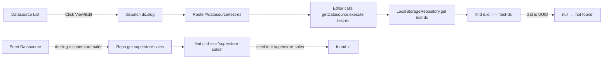

# Task: Fix datasource routing so View and Edit work after creation

## Priority

P0 — Core CRUD path is broken: user-created Datasources appear in the list but navigating to their detail page shows "Datasource not found". Saving after editing silently fails.

## Dependencies

- No task dependency; can start concurrently with other tasks.
- No ADR dependency; this task fixes an adapter-level lookup bug without changing architecture.

## Assignability

**AFK** — all requirements and acceptance criteria are resolved; the fix is a one-line change per repository with existing test structure to validate against.

## Context

When a Datasource is created via the "New Datasource" dialog (or via the editor's Create button), it is stored in `localStorage` with `id` set to a UUID (e.g. `"550e8400-e29b-..."`) and `slug` set to the human-readable name (e.g. `"test-ds"`). The datasource list (`DatasourceList`) renders it correctly because `list()` returns all records unfiltered.

However, clicking View or Edit dispatches navigation using `ds.slug`, which produces a URL like `#/datasource/test-ds`. The `datasource-editor` component calls `getDatasource.execute('test-ds')`, which delegates to `LocalStorageDatasourceRepository.get(id)`. That method runs `loadAll().find(d => d.id === id)` — but `d.id` is the UUID, not `'test-ds'` — so it returns `null`. The editor then shows "Datasource not found".

Seed Datasources work because their YAML loader sets `id` to the same value as `slug` (e.g. `id: 'superstore-sales'`).

### Flow diagram

## Use Cases

- **Feature**: Datasource CRUD
- **Scenario**: User views a newly created datasource
- **Given** a user has created a Datasource named "test-ds"
- **When** the user clicks the View or Edit action on that datasource in the list
- **Then** the datasource editor loads the complete configuration with all fields populated

## Definition of Ready

- The `DatasourceRepository` interface is already defined with `get(id: string): Promise<Datasource | null>`.
- `LocalStorageDatasourceRepository.get()` and `SeededDatasourceRepository.get()` implementations are known.
- The seed vs. user datasource ID assignment strategy is documented: seeds use `id = slug`, user-created use `id = UUID`.

## Functional Requirements

- `FR-001`: `LocalStorageDatasourceRepository.get()` must return a Datasource when called with either its `id` (UUID) or its `slug`.
- `FR-002`: `SeededDatasourceRepository.get()` must continue to match seed Datasources by `id` (which equals `slug` for seeds).
- `FR-003`: `UpdateDatasource` use case must succeed when called with a slug after the repository `get()` fix is applied.

## Non-Functional Requirements

- `NFR-001`: The lookup must remain a single pass over the in-memory array — no new indexes or queries.
- `NFR-002`: The fix must not change the `DatasourceRepository.get()` signature or the route URL format.

## Observability Requirements

- `OBS-001`: Not applicable — existing logging in the datasource use cases already captures mutation failures; the fix makes those paths succeed rather than throw.

## Acceptance Criteria

- `AC-001`: **Given** a user-created Datasource with name "test-ds", **When** `LocalStorageDatasourceRepository.get('test-ds')` is called, **Then** it returns the Datasource record (not null).
- `AC-002`: **Given** a user-created Datasource with UUID id `"550e8400-..."` and slug `"test-ds"`, **When** `LocalStorageDatasourceRepository.get('550e8400-...')` is called, **Then** it returns the same record (backward-compatible id lookup).
- `AC-003`: **Given** the seed "sales" Datasource with `id: 'superstore-sales'`, **When** `SeededDatasourceRepository.get('superstore-sales')` is called, **Then** it returns the seed record (no regression).
- `AC-004`: **Given** the app runs in client-only mode, **When** a user creates a Datasource, navigates to its detail page, edits fields, and clicks Create/Save, **Then** the changes are persisted without a "Datasource not found" error.

## Required Tests

### Unit Tests

- `UT-001`: Verify `LocalStorageDatasourceRepository.get()` returns a record when queried by `slug` and when queried by `id`. Covers `FR-001`, `AC-001`, `AC-002`.
- `UT-002`: Verify `LocalStorageDatasourceRepository.get()` returns `null` for a non-existent id/slug. Covers boundary.

### Integration Tests

- `IT-001`: **Scenario**: User-created Datasource is retrievable by slug through the repository chain  
  **Given** a `SeededDatasourceRepository` wrapping a `LocalStorageDatasourceRepository`  
  **When** `get('test-ds')` is called  
  **Then** the Datasource is returned with matching name and type  
  Covers `FR-001`, `FR-002`.

### Smoke Tests

- `SMK-001`: **Scenario**: Datasource views load after the fix  
  **Given** the app is running in client-only mode  
  **When** the user navigates to `#/datasource/test-ds`  
  **Then** the page shows the datasource editor without a "not found" alert  
  Covers `AC-004`.

### End-to-End Tests

- `E2E-001`: **Scenario**: Create, view, and update a Datasource  
  **Given** a user on the Datasources page  
  **When** they create a new Datasource with name "e2e-test", then click View  
  **Then** the editor shows the datasource configuration  
  **And** after editing the description and saving, the list shows the updated description  
  Covers `AC-004`.

### Regression Tests

- `REG-001`: **Scenario**: Seed Datasource View still works  
  **Given** a seed Datasource "sales"  
  **When** `get('superstore-sales')` is called  
  **Then** the seed Datasource is returned  
  Covers `FR-002`.

### Performance Tests

- `PT-001`: Not applicable — the change adds a single `||` condition to an existing `Array.find()` callback with no measurable performance impact.

### Security Tests

- `ST-001`: Not applicable — no new input, storage, or external communication is introduced.

### Usability Tests

- `UX-001`: Not applicable — the fix restores existing expected behavior; no UI change.

### Observability Tests

- `OT-001`: Not applicable — runtime telemetry is unchanged.

## Definition of Done

- `LocalStorageDatasourceRepository.get()` matches by both `id` and `slug`.
- Existing unit and integration tests pass.
- `E2E-001` passes, verifying the full create→view→update flow.
- `REG-001` passes, verifying seed datasource lookup is unaffected.
