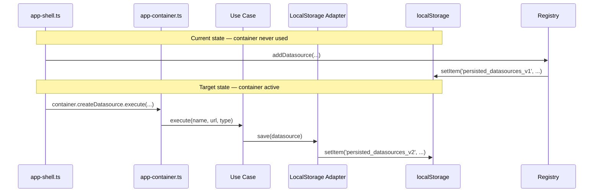

# Task: Activate the composition container in AppShell and retire direct Registry imports

## Priority

P1 — The composition container (`src/composition/`) and all new use cases and adapters are currently dead code: `app-container.ts` never exports `_container`, and `AppShell` imports directly from the legacy Registries. This task activates the hexagonal architecture already built.

## Dependencies

- Depends on Task 001: the `datasource-registry.ts` ID-generation fix must be in place before this task begins to avoid generating colliding IDs during any migration boot pass.
- Depends on ADR `docs/adrs/006-registry-retirement-and-data-migration.md` — the localStorage key migration strategy must be decided before implementation begins.
- Requires a field-by-field comparison between `DatasourceConfig` (registry shape) and `Datasource` entity (adapter shape) to write the migration function.

## Assignability

**HITL** — requires human decision on the migration strategy in ADR `docs/adrs/006-registry-retirement-and-data-migration.md` before work starts. Specifically: whether existing `v1` data is migrated to a new `v2` key, retained in `v1`, or silently abandoned.

## Context

The codebase has two parallel data layers: the legacy **Registries** (`datasource-registry.ts`, `question-registry.ts`, `dashboard-registry.ts`) and the new hexagonal **Adapters** (`LocalStorageDatasourceRepository`, `LocalStorageQuestionRepository`, `LocalStorageDashboardRepository`). The Registries are standalone modules with in-memory state and direct localStorage calls. The Adapters implement the port interfaces used by the Use Cases.

`AppShell` (`src/app/shell/app-shell.ts`) currently imports and calls the legacy Registry mutation functions directly:

```ts
import { addDashboard, getDashboardBySlug } from '../../features/dashboard/data/dashboard-registry';
import { addDatasource } from '../../features/datasource/data/datasource-registry';
import { addQuestion } from '../../features/question/data/question-registry';
```

`app-container.ts` creates the composition container but never exports it, so no component can call the Use Cases. As a result, the Clock port is bypassed (timestamps use `new Date()` inline), IDs are generated with `Date.now()` instead of `crypto.randomUUID()`, and the `LocalStorageDashboardRepository` is completely unused.

This task also covers two secondary defects uncovered in the same layer:

- **Clock port bypassed in `LocalStorageDatasourceRepository.save()`** (`src/adapters/client/local-storage/local-storage-datasource-repository.ts:37`): `updatedAt` is set with `new Date().toISOString()` instead of an injected `Clock`.
- **Unsafe cast in `app-container.ts:9`**: `createClientServerContainer() as unknown as AppContainer` hides structural mismatches between the two containers.



## Use Cases

- **Feature**: Datasource management via composition container
- **Scenario**: User creates a new Datasource through the AppShell
- **Given** the AppShell is mounted with the composition container active
- **When** the user submits a new Datasource name and URL
- **Then** the Datasource is saved via `CreateDatasource` use case and persisted by `LocalStorageDatasourceRepository`
- **And** the ID is a UUID, the timestamp comes from the `SystemClock`, and the record is readable on next page load

- **Feature**: Existing data preservation
- **Scenario**: User who previously saved Datasources loads the app after the migration
- **Given** the user's localStorage contains Datasource records in the legacy `v1` key
- **When** the AppShell boots for the first time after this change is deployed
- **Then** those Datasources are visible in the Datasource list without the user re-entering them

## Definition of Ready

- ADR `docs/adrs/006-registry-retirement-and-data-migration.md` is accepted with a chosen option.
- A field-by-field mapping between `DatasourceConfig` (registry shape) and `Datasource` entity is documented.
- Task 001 is merged (non-unique ID fix in datasource-registry).

## Functional Requirements

- `FR-001`: `app-container.ts` exports the container so `AppShell` can import it.
- `FR-002`: `AppShell` calls `container.createDatasource.execute(...)`, `container.createQuestion.execute(...)`, and `container.createDashboard.execute(...)` instead of Registry mutation functions.
- `FR-003`: `AppShell` calls `container.getDashboard.execute(slug)` instead of `getDashboardBySlug(slug)`.
- `FR-004`: `LocalStorageDatasourceRepository` and `LocalStorageQuestionRepository` receive a `Clock` port in their constructors and use `clock.now()` in `save()` for `updatedAt`.
- `FR-005`: The composition container handles the `v1` → `v2` key migration at boot according to the strategy chosen in ADR-001.
- `FR-006`: The `as unknown as AppContainer` cast in `app-container.ts` is removed and replaced with an explicit shared `AppContainer` interface or a structural assertion.

## Non-Functional Requirements

- `NFR-001`: Existing user data in the `v1` localStorage keys is not silently discarded (unless ADR-001 explicitly accepts data loss with user-visible notification).
- `NFR-002`: TypeScript compiles without errors after the cast removal and the container export are in place.
- `NFR-003`: ESLint `boundaries/dependencies` rules continue to pass after the wiring changes.

## Observability Requirements

- `OBS-001`: The existing `AppLogger` calls in Use Cases and adapters are sufficient; no new observability is required for this task.

## Acceptance Criteria

- `AC-001`: **Given** the AppShell is mounted, **When** the user creates a Datasource, **Then** the Datasource record appears in `localStorage` under the `v2` key (not `v1`) with a UUID `id` and an ISO timestamp `createdAt`.
- `AC-002`: **Given** existing records in `persisted_datasources_v1`, **When** the app boots, **Then** those records are readable through `container.listDatasources.execute()`.
- `AC-003`: **Given** the `VITE_RUNTIME_MODE` is unset or `client-only`, **When** the container is created, **Then** TypeScript reports no type errors (no `as unknown as` casts required).
- `AC-004`: **Given** a `Clock` port returning `'2025-01-01T00:00:00.000Z'`, **When** `LocalStorageDatasourceRepository.save()` is called with a Datasource, **Then** the persisted record has `updatedAt: '2025-01-01T00:00:00.000Z'`.

## Required Tests

### Unit Tests

- `UT-001`: Call `LocalStorageDatasourceRepository.save()` with a stubbed `Clock`; assert `updatedAt` equals the stubbed clock value. Covers `FR-004`, `AC-004`.
- `UT-002`: Call `LocalStorageQuestionRepository.save()` with a stubbed `Clock`; assert `updatedAt` equals the stubbed clock value. Covers `FR-004`.
- `UT-003`: Verify `createClientOnlyContainer()` and `createClientServerContainer()` both satisfy the shared `AppContainer` interface without casts. Covers `FR-006`, `AC-003`.

### Integration Tests

- `IT-001`: **Scenario**: Datasource round-trip through composition container  
  **Given** a clean localStorage and the client-only container  
  **When** `container.createDatasource.execute({ name: 'Sales', url: '...', type: 'csv' })` is called  
  **Then** `container.listDatasources.execute()` returns a list containing a Datasource with a UUID `id`  
  **And** the record is stored in `localStorage` under the `v2` key  
  Covers `FR-001`, `FR-002`, `AC-001`.

- `IT-002`: **Scenario**: Legacy `v1` data is visible after migration  
  **Given** `localStorage` contains a valid Datasource record under `persisted_datasources_v1`  
  **When** the container boots and the migration runs  
  **Then** `container.listDatasources.execute()` returns that Datasource  
  **And** `localStorage` no longer contains `persisted_datasources_v1` (if option 2 from ADR-001 is chosen)  
  Covers `FR-005`, `AC-002`.

### Smoke Tests

Not applicable — this task changes internal wiring; the AppShell continues to render. No new startup path is introduced.

### End-to-End Tests

- `E2E-001`: **Scenario**: Create and persist a Datasource across page reload  
  **Given** the app is loaded in the browser  
  **When** the user creates a Datasource named "Test Source" and reloads the page  
  **Then** "Test Source" appears in the Datasource list after reload  
  Covers `FR-002`, `AC-001`.

### Regression Tests

- `REG-001`: **Scenario**: Existing user Datasources are not lost after the registry transition  
  **Given** `localStorage` has Datasources stored under the legacy `v1` key  
  **When** the app boots after this change is deployed  
  **Then** all previously saved Datasources are visible without re-entry  
  Covers `NFR-001`, `AC-002`.

### Performance Tests

Not applicable — no performance-critical path changes; localStorage round-trip performance is unchanged.

### Security Tests

Not applicable — this task does not touch authentication, authorization, input handling, secrets, or trust boundaries.

### Usability Tests

Not applicable — user-visible behaviour is unchanged; the same form submits to a different internal wiring.

### Observability Tests

Not applicable — no new telemetry paths are introduced; existing logger calls in Use Cases are sufficient.

## Definition of Done

- `app-container.ts` exports the container.
- `AppShell` imports only from the composition container, not from Registry modules.
- `LocalStorageDatasourceRepository` and `LocalStorageQuestionRepository` accept a `Clock` port.
- The `as unknown as AppContainer` cast is removed.
- `IT-001`, `IT-002`, `E2E-001`, `REG-001`, and all unit tests pass.
- `npm run typecheck` and `npm run lint` pass without new errors.
- ADR `docs/adrs/006-registry-retirement-and-data-migration.md` is updated from `Proposed` to `Accepted` with the chosen migration option.
