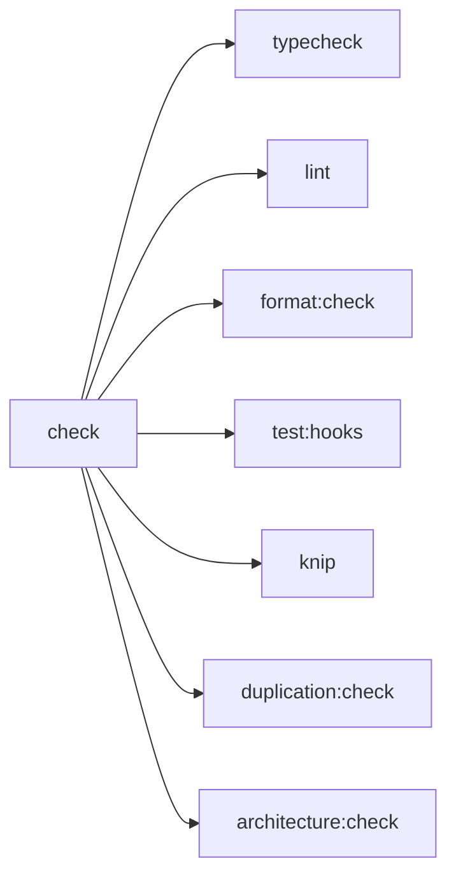

# Task: Add unified check script and CI quality gate workflow

## Priority

P3 — Depends on Tasks 015–019 all completing successfully so the `check` command can exit 0.

## Dependencies

- Depends on Task 015 (`015-extend-eslint-type-safety-size-naming-rules`): `pnpm lint` must exit 0 (with known violations documented, not silently ignored).
- Depends on Task 016 (`016-add-unicorn-jsdoc-eslint-plugins`): unicorn and jsdoc rules must be active.
- Depends on Task 017 (`017-enable-missing-typescript-strict-options`): `pnpm typecheck` must exit 0.
- Depends on Task 018 (`018-add-jscpd-duplication-detection`): `pnpm duplication:check` must be runnable.
- Depends on Task 019 (`019-add-dependency-cruiser-circular-dependency-check`): `pnpm architecture:check` must exit 0.
- No ADR dependency.

## Assignability

**HITL** — the CI workflow scope requires a human decision on which test suite to include in the quality gate. The full test suite (`test:integration` + `test:e2e`) requires a browser environment and can be slow or flaky in CI. The decision point is: _run all tests in CI_ vs _run only the fast test subset (`test:hooks`) in the gate and schedule integration/e2e as a separate nightly job_.

## Context

After Tasks 015–019, the project has all the individual check commands. This task wires them together into:

1. A single `check` script in `package.json` that a developer can run locally.
2. A GitHub Actions workflow that runs `pnpm check` on every push and pull request to `master`.

The existing CI at `.github/workflows/publish.yml` runs only `pnpm build` and deploys to GitHub Pages. It does not run quality checks. A separate workflow file (`.github/workflows/quality.yml`) is added so the publish pipeline is not disrupted.

**Package manager consistency**: the project has both `pnpm-lock.yaml` and `package-lock.json`. CI already uses `pnpm` (`pnpm build` in `publish.yml`). The internal `package.json` scripts still reference `npm run` in composite commands (`test:serial` calls `npm run test`, husky hooks call `npm run ...`). This task normalizes those references to `pnpm run` so CI behaves consistently with local development.

**Test scope in the gate**: `test:hooks` runs unit + component + storybook tests — the fast, non-browser-dependent subset. Integration and e2e tests require Cucumber + browser automation and are excluded from the synchronous `check` gate to keep it under 5 minutes. They remain runnable via `pnpm test:integration` and `pnpm test:e2e` independently.



## Use Cases

- **Feature**: One-command local quality gate
- **Scenario**: Developer runs all checks before pushing
- **Given** the developer has made changes in `src/`
- **When** they run `pnpm check`
- **Then** typecheck, lint, format, fast tests, knip, duplication, and architecture checks all run in sequence and report any failures

---

- **Feature**: CI quality gate on pull requests
- **Scenario**: A PR breaks a lint rule
- **Given** a PR introduces a `console.log` in `src/core/`
- **When** the CI `quality.yml` workflow runs `pnpm check`
- **Then** the `lint` step fails and the PR is blocked until the violation is fixed

## Definition of Ready

- Tasks 015, 016, 017, 018, and 019 are all complete and their respective scripts exit 0 on the unmodified codebase.
- The `.github/workflows/setup-node/action.yml` composite action exists (already confirmed in the repository).
- A human has approved the test scope decision (fast tests only vs full suite) before this task is implemented.

## Functional Requirements

- `FR-001`: The following script is added to `package.json`:
  ```json
  "check": "pnpm typecheck && pnpm lint && pnpm format:check && pnpm test:hooks && pnpm knip && pnpm duplication:check && pnpm architecture:check"
  ```
- `FR-002`: Internal `npm run` references in composite scripts (`test:serial`, `test:unit:serial`) and husky hooks (`.husky/pre-commit`, `.husky/pre-push`) are changed to `pnpm run` for consistency. The `test:hooks` script itself becomes `pnpm run test:unit && pnpm run test:components && pnpm run test:storybook` (or equivalent) if needed.
- `FR-003`: `.github/workflows/quality.yml` is created with:
  - Trigger: `push` to `master` and `pull_request` targeting `master`.
  - Single job `quality` on `ubuntu-latest`.
  - Steps: checkout → setup-node (reuse `.github/workflows/setup-node`) → `pnpm install --frozen-lockfile` → `pnpm check`.
  - No secrets or environment variables required.
- `FR-004`: The existing `.github/workflows/publish.yml` is not modified.
- `FR-005`: `reports/duplication/` remains in `.gitignore` and is not uploaded as a CI artifact in the quality workflow (the console output is sufficient for CI feedback).
- `FR-006`: The `"deps:check"` alias script is added as: `"deps:check": "pnpm knip"` so the canonical name from the toolset spec is available alongside the existing `"knip"` script.

## Non-Functional Requirements

- `NFR-001`: `pnpm check` completes in under 5 minutes on the developer's machine and in CI.
- `NFR-002`: The CI workflow uses `pnpm install --frozen-lockfile` so dependency drift is caught.
- `NFR-003`: The CI workflow fails fast — if `typecheck` fails, `lint` does not run, saving CI minutes.
- `NFR-004`: The quality workflow does not require any repository secrets, deploy keys, or write permissions.

## Observability Requirements

- `OBS-001`: CI step names in `quality.yml` are explicit (`Run typecheck`, `Run lint`, etc.) so the GitHub Actions UI shows which check failed without reading the log.
- `OBS-002`: `pnpm check` output is human-readable: each tool prints its own summary line, and the overall exit code signals pass/fail.

## Acceptance Criteria

- `AC-001`: **Given** the codebase is in its post-Tasks-015–019 state, **When** `pnpm check` runs locally, **Then** it exits 0 and prints a summary from each tool.
- `AC-002`: **Given** a lint violation is introduced, **When** `pnpm check` runs, **Then** it exits non-zero after the `lint` step without running subsequent steps.
- `AC-003`: **Given** a push to `master` on GitHub, **When** the `quality.yml` workflow triggers, **Then** all steps complete and the workflow exits 0.
- `AC-004`: **Given** `npm run` is searched in `.husky/` and `package.json`, **Then** no `npm run` references remain (all replaced by `pnpm run`).
- `AC-005`: **Given** the `deps:check` script, **When** `pnpm deps:check` runs, **Then** it executes `knip` and exits with the same code as `pnpm knip`.

## Required Tests

### Unit Tests

Not applicable — script wiring is verified by running the commands, not by unit tests.

### Integration Tests

- `IT-001`: **Scenario**: Unified check script exits 0 on clean codebase  
  **Given** the post-015–019 codebase with no introduced violations  
  **When** `pnpm check` runs  
  **Then** all seven sub-commands complete successfully and the process exits 0  
  Covers `FR-001`, `AC-001`.

- `IT-002`: **Scenario**: Lint failure short-circuits the check  
  **Given** a temporary source file containing `console.log("debug")` in `src/core/`  
  **When** `pnpm check` runs  
  **Then** the process exits non-zero after the lint step and `duplication:check` is not reached  
  Covers `FR-001`, `AC-002`.

### Smoke Tests

- `SMK-001`: **Scenario**: CI quality workflow runs successfully on `master`  
  **Given** the `quality.yml` workflow is committed to `master`  
  **When** a push is made to `master`  
  **Then** the GitHub Actions workflow completes without errors  
  Covers `FR-003`, `AC-003`.

### End-to-End Tests

Not applicable — the quality gate itself is the subject; no user journey changes.

### Regression Tests

Not applicable — no known previous defect related to the check script.

### Performance Tests

- `PT-001`: Run `pnpm check` on the post-015–019 codebase and verify total wall-clock time is under 5 minutes. Covers `NFR-001`.

### Security Tests

Not applicable — the quality workflow requires no secrets or write permissions; no trust boundary changes.

### Usability Tests

Not applicable — no user-facing behavior changes.

### Observability Tests

Not applicable — the check script's console output is its own observability.

## Definition of Done

- `"check"` and `"deps:check"` scripts are in `package.json`.
- All `npm run` references in `.husky/` hooks and composite `package.json` scripts are replaced with `pnpm run`.
- `.github/workflows/quality.yml` exists and is syntactically valid YAML.
- `publish.yml` is unchanged.
- `IT-001` and `IT-002` pass locally.
- `SMK-001` passes on GitHub Actions after merge to `master`.
- `PT-001` is verified (check completes in under 5 minutes).
- Human reviewer has approved the test-scope decision (fast tests vs full suite in the gate).
