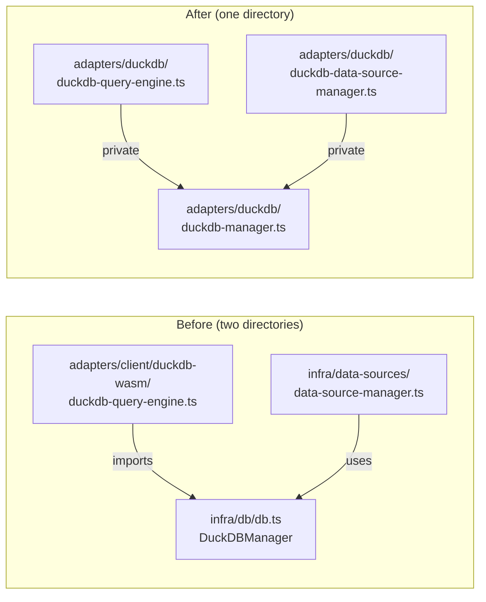

# Task: Merge infra/ into adapters/duckdb/

## Priority

P0 — Removes the false `infra/` architectural layer that the ESLint boundary config names but that adds no isolation value. Doing this early prevents new code from being placed in `infra/` and allows the boundary config to simplify.

## Dependencies

- No task dependency; can start immediately in parallel with task 021.
- Depends on ADR `docs/adrs/005-merge-infra-into-adapters.md` — the decision to dissolve `infra/` as a named layer must be recorded before implementation.

## Assignability

**AFK** — all requirements are resolved; the move is mechanical once ADR 005 is written and accepted.

## Context

`src/infra/db/db.ts` (`DuckDBManager`) and `src/infra/data-sources/data-source-manager.ts` are the implementation details of the DuckDB adapter. They live in `infra/` but are consumed only by `adapters/client/duckdb-wasm/duckdb-query-engine.ts`. There is no other consumer and no reason to separate them across two directory trees.

The split creates a two-hop traversal (`adapter → infra → WASM`) that makes the adapter look thin while hiding its real complexity inside `infra/`. Merging them into a unified `adapters/duckdb/` makes the boundary between the DuckDB adapter and everything else explicit and self-contained.

## Use Cases

- **Feature**: DuckDB WASM query execution
- **Scenario**: Developer navigates to the DuckDB adapter to understand its internals
- **Given** the developer opens `adapters/duckdb/`
- **When** they read the directory
- **Then** all DuckDB WASM initialization, connection pooling, view creation, and query execution are visible in one place

## Definition of Ready

- ADR `docs/adrs/005-merge-infra-into-adapters.md` is written and accepted.
- `architecture-boundaries.config.cjs` is understood so the `infra` zone can be removed.
- All import sites of `infra/db/db.ts` and `infra/data-sources/data-source-manager.ts` are known.

## Functional Requirements

- `FR-001`: `src/infra/` directory is deleted.
- `FR-002`: `DuckDBManager` (was `infra/db/db.ts`) is located at `src/adapters/duckdb/duckdb-manager.ts`.
- `FR-003`: `DuckDBDataSourceManager` (was `infra/data-sources/data-source-manager.ts`) is located at `src/adapters/duckdb/duckdb-data-source-manager.ts`.
- `FR-004`: `DuckDBQueryEngine` (was `adapters/client/duckdb-wasm/duckdb-query-engine.ts`) is located at `src/adapters/duckdb/duckdb-query-engine.ts`.
- `FR-005`: All import sites that previously referenced `src/infra/` or `src/adapters/client/duckdb-wasm/` are updated to `src/adapters/duckdb/`.
- `FR-006`: `architecture-boundaries.config.cjs` no longer declares `infra` as a named zone.

## Non-Functional Requirements

- `NFR-001`: DuckDB WASM query execution and view creation behavior is unchanged; existing DuckDB adapter tests pass.
- `NFR-002`: ESLint boundary config is simpler after this task — one fewer named zone.

## Observability Requirements

- `OBS-001`: Not applicable — no telemetry behavior changes; DuckDBManager's existing performance logging remains in place at its new path.

## Acceptance Criteria

- `AC-001`: **Given** the refactored codebase, **When** `find src/infra` runs, **Then** no such path exists.
- `AC-002`: **Given** the refactored codebase, **When** `grep -r 'from.*infra/' src/` runs, **Then** no results are found.
- `AC-003`: **Given** a client-only deployment, **When** the user executes a SQL query against a loaded datasource, **Then** the result is correct and matches pre-refactor behavior.
- `AC-004`: **Given** the refactored codebase, **When** ESLint runs, **Then** no boundary violations are reported and the `infra` zone is absent from the config.

## Required Tests

### Unit Tests

- `UT-001`: Verify that `DuckDBQueryEngine` at its new path executes a simple `SELECT 1` and returns the correct `QueryResult`. Covers `FR-002`, `FR-004`, `AC-003`.

### Integration Tests

- `IT-001`: **Scenario**: DuckDB adapter initializes and queries after the move  
  **Given** a `DuckDBQueryEngine` constructed from `adapters/duckdb/`  
  **When** it receives `execute(datasourceId, "SELECT 1 AS n")`  
  **Then** it returns `{ columns: ['n'], rows: [{ n: 1 }] }`  
  Covers `FR-002`, `FR-004`, `AC-003`.

### Smoke Tests

- `SMK-001`: Not applicable — DuckDB WASM is a browser-only runtime; startup availability is covered by existing client-only smoke tests, which must still pass.

### End-to-End Tests

- `E2E-001`: Not applicable — no user journey changes; only internal file paths change.

### Regression Tests

- `REG-001`: Not applicable — no known previous defect related to DuckDB path layout.

### Performance Tests

- `PT-001`: Not applicable — this task only moves files; no runtime performance characteristics change.

### Security Tests

- `ST-001`: Not applicable — this task does not touch authentication, authorization, input handling, or secrets.

### Usability Tests

- `UX-001`: Not applicable — no user-visible behavior changes.

### Observability Tests

- `OT-001`: Not applicable — existing DuckDB telemetry paths are preserved at the new file location with no behavioral changes.

## Definition of Done

- Code is implemented; `src/infra/` does not exist.
- All imports updated; `tsc --noEmit` passes.
- `architecture-boundaries.config.cjs` no longer names `infra` as a zone.
- Required tests pass (`UT-001`, `IT-001`).
- ADR `docs/adrs/005-merge-infra-into-adapters.md` updated to `Accepted`.
