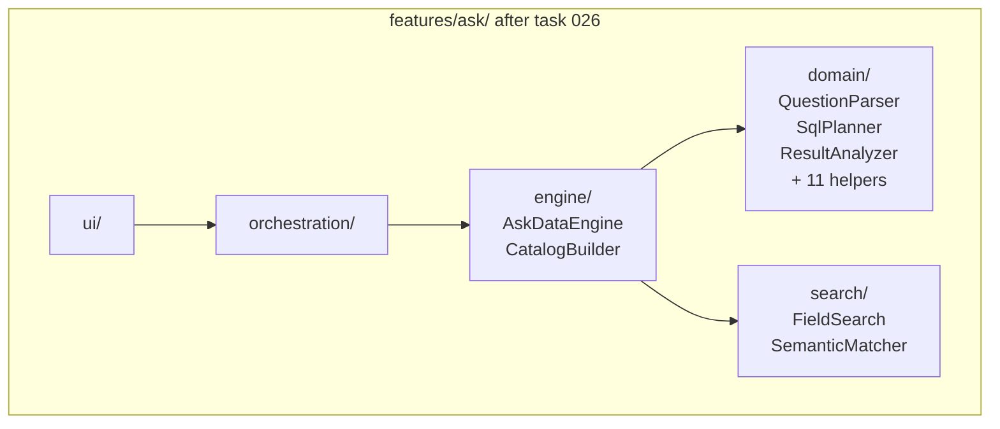

# Task: Reorganize features/ask/model/ into ask/domain/ and ask/engine/

## Priority

P2 — Depends on task 025. Once library-specific search is extracted, the remaining model/ files split cleanly along a stable seam. This rename answers ADR 001's open question about feature organization and makes the promotion path to `core/` visible.

## Dependencies

- Depends on task 025 (extract library-specific search backends) — `model/` must be free of library imports before splitting; otherwise `domain/` would inherit the library coupling from day one.
- Depends on ADR `docs/adrs/001-define-clean-architecture-boundaries.md` — this task answers the open question: "Should features be organized as `features/<capability>/{application,domain,ui}` or should application/domain stay only under `src/core`?"

## Assignability

**AFK** — all requirements are resolved after task 025 completes; the split is deterministic based on "does the file use QueryPort or external libraries?" (→ engine/) vs. "pure logic?" (→ domain/).

## Context

After task 025, `features/ask/model/` contains two cleanly separable groups:

- **Pure domain logic** — no external library imports, no I/O: `question-parser.ts`, `sql-planner.ts`, `sql-renderer.ts`, `result-analysis.ts`, `narrative-generator.ts`, `intent-cue-detector.ts`, `intent-describer.ts`, `date-range-parser.ts`, `date-question-text.ts`, `month-catalog.ts`, `term-matcher.ts`, `value-filter-resolver.ts`, `semantic-modeling.ts`, `vocabulary.ts`.
- **Engine** — stateful, uses `QueryPort`, produces `AskDataResponse`: `ask-data.ts` (`AskDataEngine`), `catalog-builder.ts`.

Naming them `domain/` and `engine/` makes the promotion path explicit: files in `domain/` are candidates for `core/` in a future batch once they stabilize. Files in `engine/` own the AskEngine port implementation and must always stay in `features/`.

## Use Cases

- **Feature**: Ask Data architecture clarity
- **Scenario**: Developer locates the SQL planning logic
- **Given** the reorganized `features/ask/` directory
- **When** the developer opens `features/ask/domain/sql-planner.ts`
- **Then** the file contains only pure planning logic with no QueryPort calls, no Fuse imports, and no DuckDB references

- **Feature**: Ask Data engine promotion readiness
- **Scenario**: Architect evaluates whether `QuestionParser` can graduate to `core/`
- **Given** `features/ask/domain/question-parser.ts` exists
- **When** the architect checks its imports
- **Then** the file imports only from `core/entities/`, `core/ports/`, and sibling domain files — no features/, no libraries

## Definition of Ready

- Task 025 is complete; `features/ask/model/` contains no library imports.
- The complete list of files in `model/` is known; each file is classified as domain or engine based on the "uses QueryPort?" criterion.
- All import sites of `features/ask/model/` from orchestration/, ui/, composition/, and tests/ are identified.

## Functional Requirements

- `FR-001`: `features/ask/domain/` contains: `question-parser.ts`, `sql-planner.ts`, `sql-renderer.ts`, `result-analysis.ts`, `narrative-generator.ts`, `intent-cue-detector.ts`, `intent-describer.ts`, `date-range-parser.ts`, `date-question-text.ts`, `month-catalog.ts`, `term-matcher.ts`, `value-filter-resolver.ts`, `semantic-modeling.ts`, `vocabulary.ts`.
- `FR-002`: `features/ask/engine/` contains: `ask-data.ts` (`AskDataEngine`) and `catalog-builder.ts`.
- `FR-003`: `features/ask/model/` directory is deleted.
- `FR-004`: All import sites in `orchestration/`, `ui/`, `composition/`, and test files are updated to reference `domain/` or `engine/` as appropriate.
- `FR-005`: No file in `features/ask/domain/` imports from `adapters/`, `infra/`, `features/ask/engine/`, external libraries (Fuse, MiniSearch, Transformers, Chart.js, DuckDB, Lit), or browser APIs.

## Non-Functional Requirements

- `NFR-001`: All existing unit tests for domain files pass after the move with only import path changes — no logic changes.
- `NFR-002`: `tsc --noEmit` passes.
- `NFR-003`: `features/ask/domain/` files have zero external library imports; this can be verified by a new architecture fitness test in `shared/architecture/import-boundaries.spec.ts`.

## Observability Requirements

- `OBS-001`: Not applicable — this task is a directory reorganization; no telemetry behavior changes.

## Acceptance Criteria

- `AC-001`: **Given** the refactored codebase, **When** `find src/features/ask/model` runs, **Then** no such path exists.
- `AC-002`: **Given** the refactored codebase, **When** `ls src/features/ask/domain/` runs, **Then** all 14 domain files are present.
- `AC-003`: **Given** the refactored codebase, **When** `ls src/features/ask/engine/` runs, **Then** `ask-data.ts` and `catalog-builder.ts` are present.
- `AC-004`: **Given** a domain file in `features/ask/domain/`, **When** its imports are listed, **Then** none reference `fuse.js`, `minisearch`, `@xenova/transformers`, DuckDB, Lit, Chart.js, or any `features/ask/engine/` file.
- `AC-005`: **Given** the full test suite, **When** `pnpm test` runs, **Then** all tests pass with no failures attributable to this task.
- `AC-006`: **Given** the architecture fitness test in `import-boundaries.spec.ts`, **When** it asserts that `features/ask/domain/` files have no external library imports, **Then** it passes.

## Required Tests

### Unit Tests

- `UT-001`: Verify that `SqlPlanner` at `features/ask/domain/sql-planner.ts` produces the expected `SELECT` query for a simple dimension+metric intent (import path change only). Covers `FR-001`, `AC-002`.
- `UT-002`: Verify that `QuestionParser` at `features/ask/domain/question-parser.ts` parses a simple question into the correct `AskIntent` (import path change only). Covers `FR-001`, `AC-002`.

### Integration Tests

- `IT-001`: **Scenario**: Ask Data engine works after directory reorganization  
  **Given** an `AskDataEngine` from `features/ask/engine/`  
  **When** `.ask("total revenue by region")` is called against a catalog with those fields  
  **Then** the response is `AskDataResponse` with type `success` and an identified chart type  
  Covers `FR-002`, `AC-005`.

### Smoke Tests

- `SMK-001`: Not applicable — no deployment-time behavior changes; behavior is verified by the integration test.

### End-to-End Tests

- `E2E-001`: Not applicable — no user journey changes; only internal file paths change.

### Regression Tests

- `REG-001`: Not applicable — no known previous defect related to directory structure.

### Performance Tests

- `PT-001`: Not applicable — this task only renames directories; no runtime performance characteristics change.

### Security Tests

- `ST-001`: Not applicable — this task does not touch authentication, authorization, input handling, or secrets.

### Usability Tests

- `UX-001`: Not applicable — no user-visible behavior changes.

### Observability Tests

- `OT-001`: Not applicable — this task does not introduce or modify operationally relevant behavior.

## Definition of Done

- `features/ask/model/` does not exist.
- `features/ask/domain/` and `features/ask/engine/` exist with all required files.
- Architecture fitness test `AC-006` passes.
- Required tests pass (`UT-001`, `UT-002`, `IT-001`).
- `tsc --noEmit` passes.
- Full test suite passes.
- ADR 001 open question about feature organization is answered in the ADR document.
